# Práctica 2.5 - Guestbook con Docker Compose

---

## 🔹 Parte 1: De comandos Docker a Docker Compose

### Tarea 1.1: Revisión de la práctica anterior

Antes de comenzar, revisa los comandos que utilizaste en la Práctica 2.1 para:

1. Crear la red `red_guestbook`
2. Crear el contenedor de Redis con volumen
3. Crear el contenedor de Guestbook con variables de entorno

Identifica:

- Parámetros de red: --network red_guestbook
- Variables de entorno: -e REDIS_SERVER=redis
- Volúmenes: -v /opt/redis:/data
- Mapeo de puertos: -p 80:5000
- Comandos de ejecución: redis-server --apendonly yes

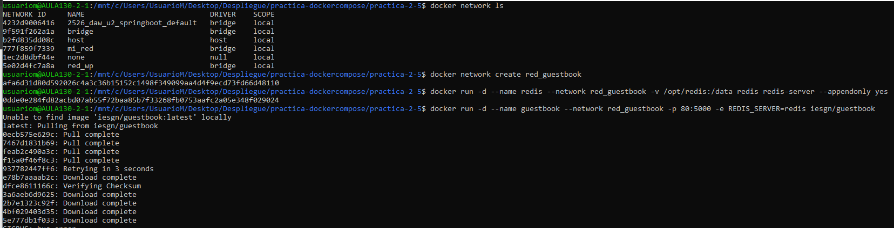

---

### Tarea 1.2: Creación del archivo docker-compose.yml

1. Crea un directorio para esta práctica, por ejemplo `~/guestbook_compose`.

2. Investiga la estructura de un archivo `docker-compose.yml` consultando la documentación oficial.

3. Crea un archivo `docker-compose.yml` que defina:

   - **Versión del formato:** Investiga qué versión de Docker Compose usar (mínimo 3.1)
   - **Dos servicios:**
     - Servicio para la aplicación Guestbook (imagen `iesgn/guestbook`)
     - Servicio para la base de datos Redis (imagen `redis`)
   - **Para el servicio de Guestbook:**
     - Nombre del contenedor
     - Puerto del host mapeado al puerto 5000 del contenedor
     - Variable de entorno que indica el servidor Redis
     - Política de reinicio automático
   - **Para el servicio de Redis:**
     - Nombre del contenedor
     - Comando para ejecutar Redis con persistencia (modo append-only)
     - Volumen Docker para almacenar datos en `/data`
     - Política de reinicio automático
   - **Volúmenes:** Define el volumen Docker necesario

4. Consulta la documentación de Docker Compose para entender:

   - La sintaxis YAML correcta
   - Cómo definir servicios
   - Cómo configurar volúmenes
   - Cómo establecer variables de entorno
   - Políticas de reinicio disponibles

**[Tu archivo docker-compose.yml aquí con comentarios]**

```yaml
version: '3.8'

services:
  app:
    image: iesgn/guestbook
    ports:
      - "80:5000"
    environment:
      REDIS_SERVER: redis
    restart: always
    depends_on:
      - redis

  redis:
    image: redis:7-alpine
    command: redis-server --appendonly yes
    volumes:
      - redis_data:/data
    restart: always

volumes:
  redis_data:
```

**[Captura de pantalla del archivo creado]**

---

### Tarea 1.3: Comprensión de las diferencias

Compara el archivo `docker-compose.yml` con los comandos de la Práctica 2.1:

1. **Red:** ¿Por qué no se define explícitamente la red en el archivo Compose?
- Porque docker compose crea automaticamente la red de tipo bridge por detecto, para todos los servicios del mismo archivo. Esto permite la comunicacion entre contenedores usando los nombres del servicio como DNS. No es necesario definilra expliciatamente a menos que se necesite una configuracion personalizada.

2. **Volumen:** ¿Qué diferencia hay entre usar un volumen Docker (`redis:`) y un bind mount (`/opt/redis:/data`)?

- La diferencia es que un volumen (redis_data:/data) te lo gestiona automaticamente docker, y la informacion se almaacena en la ubicacion controlada por docker, lo que lo hace mas portable, seguro y mejor para entornos de producción.

- Sin embargo el bind mount (/opt/redis:/data), mapea directamente la ruta del host con la del contenedor lo que es util para desarrollo donde se necesitan acceso directo a los archivos.

3. **Variables de entorno:** Aunque la variable `REDIS_SERVER` es `redis` por defecto, ¿por qué es buena práctica declararla explícitamente?

- Porque facilita los cambios futuros, y tambien es bueno para una documentacion de configuración, no solo para mi, sino para cualquier desarrollador que revise el archivo docker.

4. **Nombres de servicios:** ¿Cuál es la diferencia entre el nombre del servicio (`db`) y el nombre del contenedor (`redis`)?

- El nombre del serivicio (app, db), es el identificado que es usado por docker compose para la resolucion dns interna enre los contenedores
- El nombre del contenedor (guestbook, redis), es el nombre real del contenedor en docker, que se puede ver con `docker ps`.

---

## 🔹 Parte 2: Gestión del escenario con Docker Compose

### Tarea 2.1: Despliegue del escenario

1. Investiga qué comando de Docker Compose sirve para crear y arrancar servicios en segundo plano.

La opción `-d` que sirve para crear o arrancar servicios en modo "demonio" o tambien llamado "detached mode" (segundo plano)

Ejemplo:
```bash
docker-compose up -d
```

2. Ejecuta el comando desde el directorio donde está el archivo `docker-compose.yml`.

3. Observa la salida del comando. ¿Qué recursos se crean automáticamente?

4. Investiga y ejecuta el comando para listar los contenedores gestionados por Docker Compose.

5. Accede a la aplicación desde tu navegador en el puerto que configuraste.

6. Añade varios mensajes en el libro de visitas.

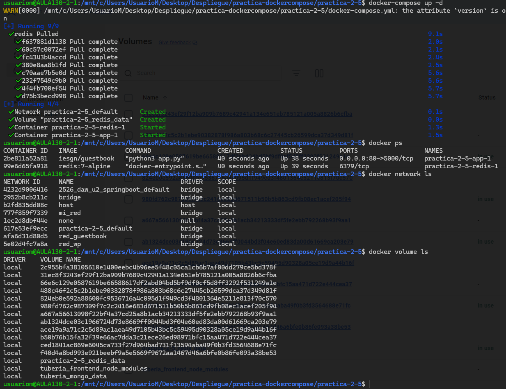
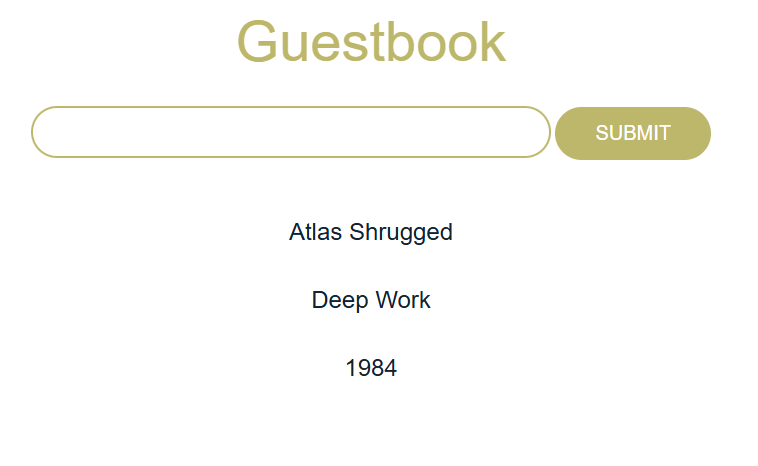

---

### Tarea 2.2: Gestión del ciclo de vida

1. **Ver logs:**
   - Investiga el comando para ver logs de todos los servicios
   - Investiga cómo ver logs de un servicio específico
   - Visualiza los logs del servicio de aplicación
   - Visualiza los logs del servicio de base de datos

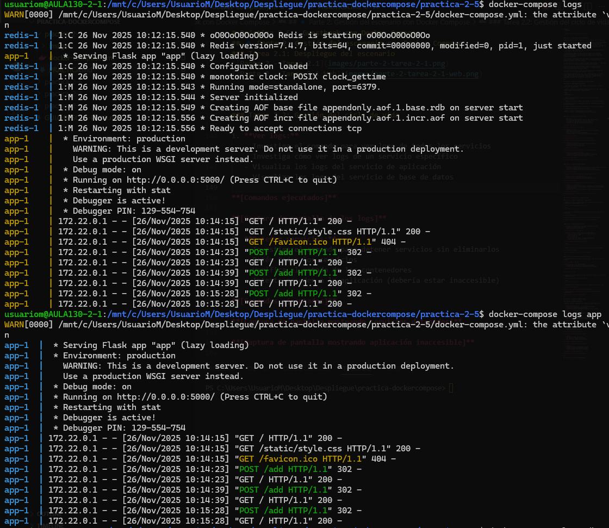
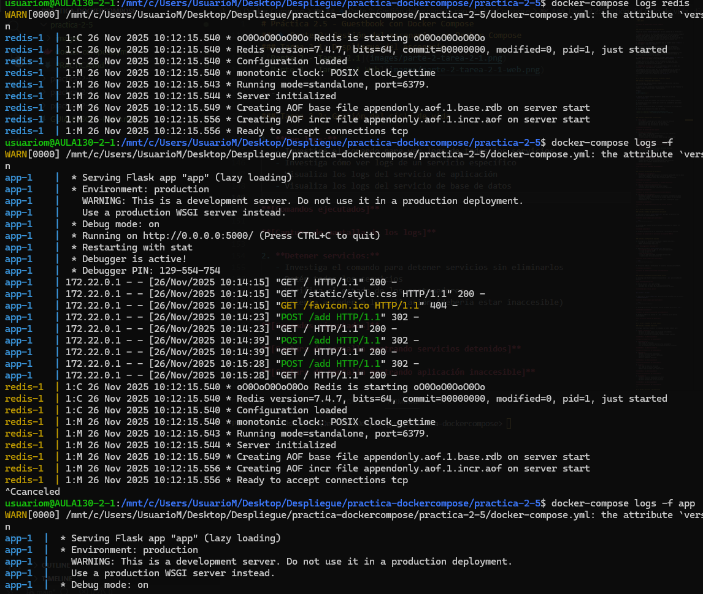

2. **Detener servicios:**
   - Investiga el comando para detener servicios sin eliminarlos
   - Detén todos los servicios
   - Verifica el estado de los contenedores
   - Intenta acceder a la aplicación (debería estar inaccesible)

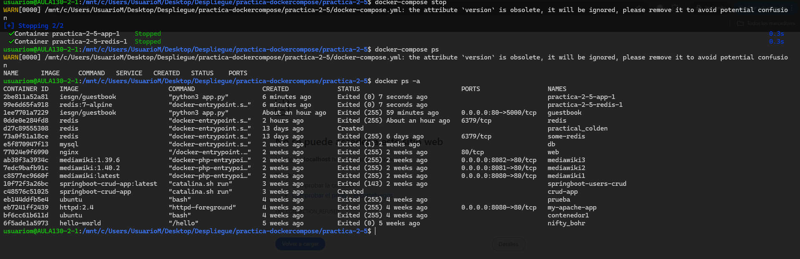
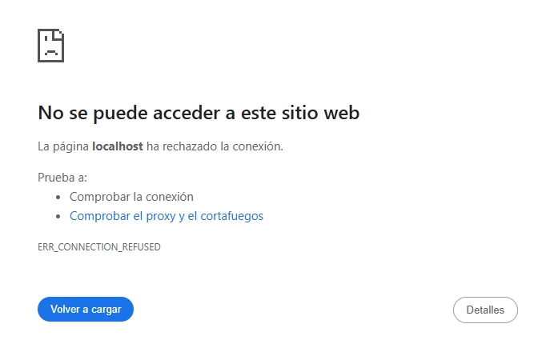

3. **Reiniciar servicios:**
   - Investiga el comando para arrancar servicios detenidos
   - Arranca nuevamente los servicios
   - Verifica que los datos persisten => SÍ, PERSISTEN

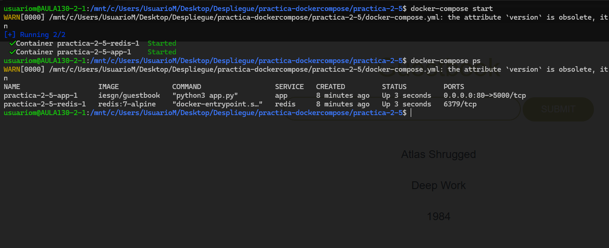

4. **Escalar servicios (opcional):**
   - Investiga el comando para escalar servicios
   - Intenta escalar el servicio de aplicación a 3 instancias
   - Observa qué problemas aparecen y analiza por qué

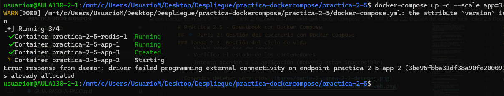

---

### Tarea 2.3: Eliminación del escenario

1. **Eliminar sin volúmenes:**
   - Investiga el comando para eliminar el escenario manteniendo los volúmenes
   - Ejecuta el comando y observa qué recursos se eliminan
   - Verifica con comandos Docker que el volumen sigue existiendo


2. **Recrear y verificar persistencia:**
   - Vuelve a crear el escenario con Docker Compose
   - Verifica que los datos del libro de visitas persisten

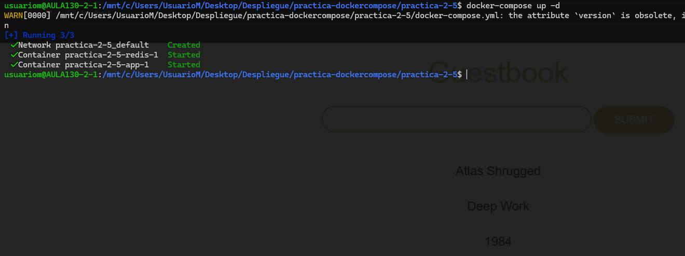

3. **Eliminar con volúmenes:**
   - Investiga el comando para eliminar el escenario incluyendo volúmenes
   - Ejecuta el comando y verifica que el volumen también se ha eliminado
   - Recrea el escenario
   - Comprueba que el libro de visitas está vacío (instalación nueva)

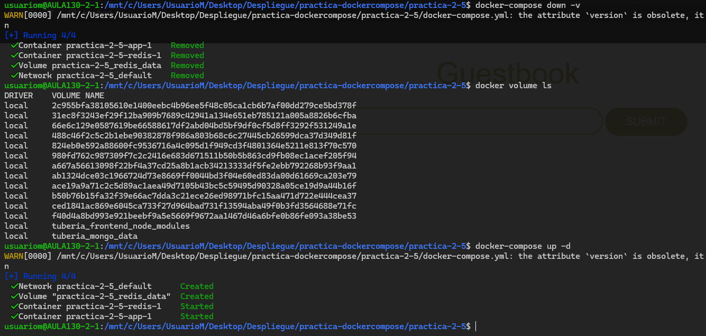

---

## 🔹 Parte 3: Modificación y personalización

### Tarea 3.1: Cambio del puerto de la aplicación

1. Modifica el archivo `docker-compose.yml` para que la aplicación sea accesible en el puerto 9090 del host.

**[Archivo docker-compose.yml modificado]**

```yaml
version: '3.8'

services:
  app:
    image: iesgn/guestbook
    ports:
      - "9090:5000"
    environment:
      REDIS_SERVER: redis
    restart: always
    depends_on:
      - redis

  redis:
    image: redis:7-alpine
    command: redis-server --appendonly yes
    volumes:
      - redis_data:/data
    restart: always

volumes:
  redis_data:
```

2. Investiga qué comando recrear el escenario aplicando los cambios sin perder datos.

```bash
docker-compose up -d
```

3. Accede a la aplicación en el nuevo puerto y verifica que funciona.

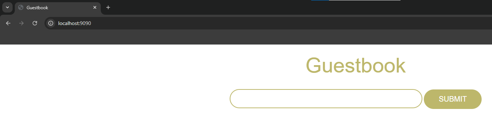

---

### Tarea 3.2: Configuración avanzada

1. Investiga en la documentación de Docker Compose cómo añadir:
   - Límites de recursos (CPU y memoria): se definen con el `deploy.resources.limits` dentro de cada definición de servicio
   - Redes personalizadas explícitas: se definen en la sección de `networks` al final y se referencian en cada servicio

2. Modifica tu archivo `docker-compose.yml` para incluir:
   - **Límites de recursos** para el servicio de aplicación:
     - Límite de memoria: 256MB
     - Límite de CPU: 0.5
   - **Red personalizada:**
     - Crea una red tipo bridge con nombre personalizado
     - Conecta ambos servicios a esta red

```yaml
version: '3.8'

services:
  app:
    image: iesgn/guestbook
    ports:
      - "9090:5000"
    environment:
      REDIS_SERVER: redis
    restart: always
    depends_on:
      - redis
    networks:
      - guestbook_net
    deploy:
      resources:
        limits:
          memory: 256M
          cpus: '0.5'

  redis:
    image: redis:7-alpine
    command: redis-server --appendonly yes
    volumes:
      - redis_data:/data
    restart: always
    networks:
      - guestbook_net

volumes:
  redis_data:

networks:
  guestbook_net:
    driver: bridge
    name: red_guestbook_custom
```

3. Aplica los cambios y verifica que el escenario funciona correctamente.

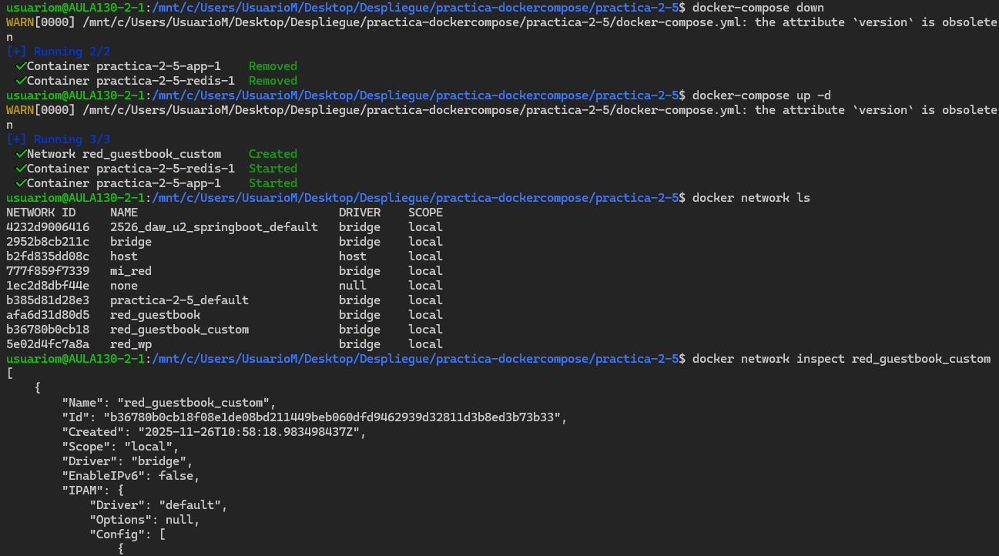

```bash
docker stats
```

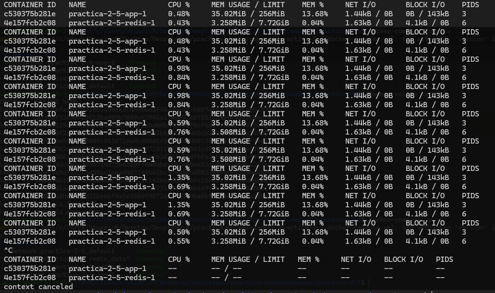

---

### Tarea 3.3: Variables de entorno desde archivo

1. Investiga cómo Docker Compose utiliza archivos `.env` para variables de entorno.

Docker Compose lee automaticamente un archivo '.env' que este en el mismo directorio y usa sus variables en el `docker-compose.yml` automaticamente con la sintaxis de `${VARIABLE}`.

2. Crea un archivo `.env` que contenga:
   - Variable para el puerto de la aplicación Guestbook
   - Variable para el nombre del contenedor/servicio de Redis

[.env](.env)

3. Modifica tu `docker-compose.yml` para usar estas variables con la sintaxis `${NOMBRE_VARIABLE}`.

**[Archivo docker-compose.yml modificado]**

```yaml
version: '3.8'

services:
  app:
    image: iesgn/guestbook
    ports:
      - "${APP_PORT}:5000"
    environment:
      REDIS_SERVER: ${REDIS_SERVICE}
    restart: always
    depends_on:
      - redis
    networks:
      - guestbook_net
    deploy:
      resources:
        limits:
          memory: 256M
          cpus: '0.5'

  redis:
    image: redis:7-alpine
    command: redis-server --appendonly yes
    volumes:
      - redis_data:/data
    restart: always
    networks:
      - guestbook_net

volumes:
  redis_data:

networks:
  guestbook_net:
    driver: bridge
    name: red_guestbook_custom
```

4. Despliega y verifica que funciona con las variables del archivo `.env`.

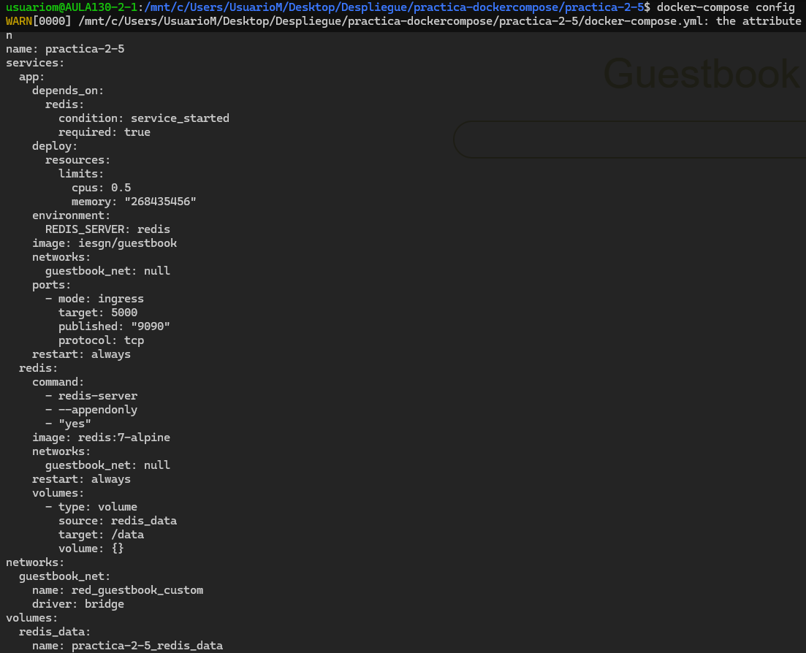
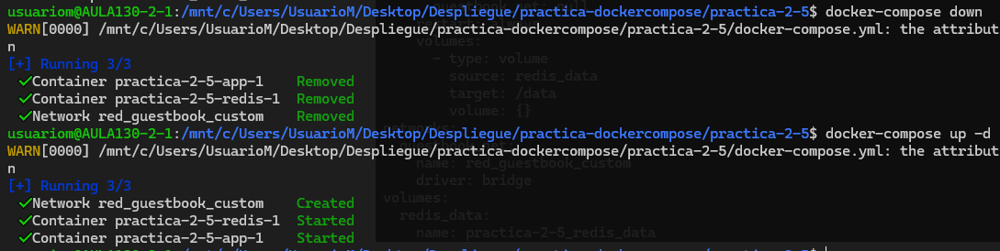

5. Prueba a cambiar los valores en `.env` y verifica que se aplican correctamente.

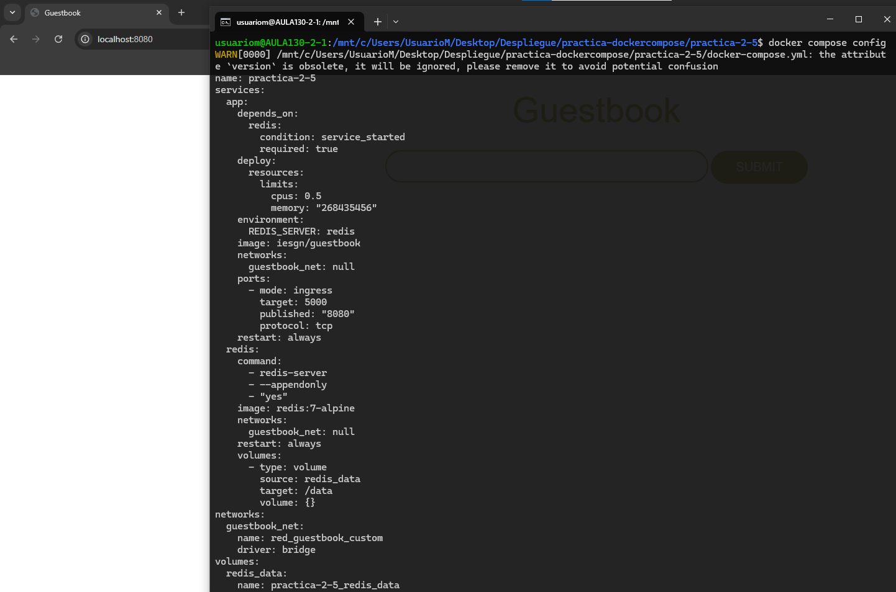

---

## 🔹 Parte 4: Comandos de Docker Compose

### Tarea 4.1: Comandos esenciales

Investiga, practica y documenta los comandos de Docker Compose para:

1. **Crear y arrancar:**
   - Arrancar en primer plano (ver la salida directamente): `docker-compose up`
   - Arrancar en segundo plano (modo daemon) `docker-compose up -d`
   - Forzar recreación de contenedores aunque no hayan cambiado `docker-compose up -d --force-recreate`
   - Para recrear un solo servicio en especifico: `docker-compose up -d --force-recreate app`

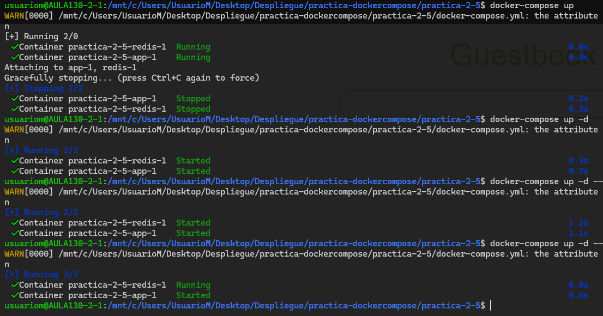

2. **Información:**
   - Ver estado de servicios: `docker-compose ps`
   - Ver procesos en ejecución dentro de los contenedores `docker-compose top`
   - Ver la configuración final con variables de entorno resueltas `docker-compose config`

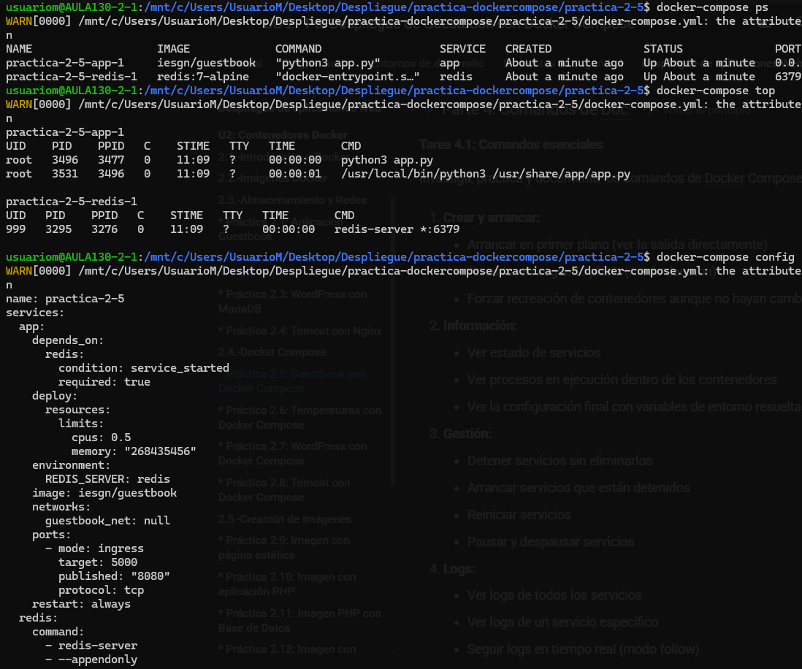

3. **Gestión:**
   - Detener servicios sin eliminarlos: `docker-compose stop`
   - Arrancar servicios que están detenidos: `docker-compose start`
   - Reiniciar servicios: `docker-compose restart`
   - Pausar y despausar servicios: `docker-compose pause` para pausar y `docker-compose unpause` para despausar los servicios

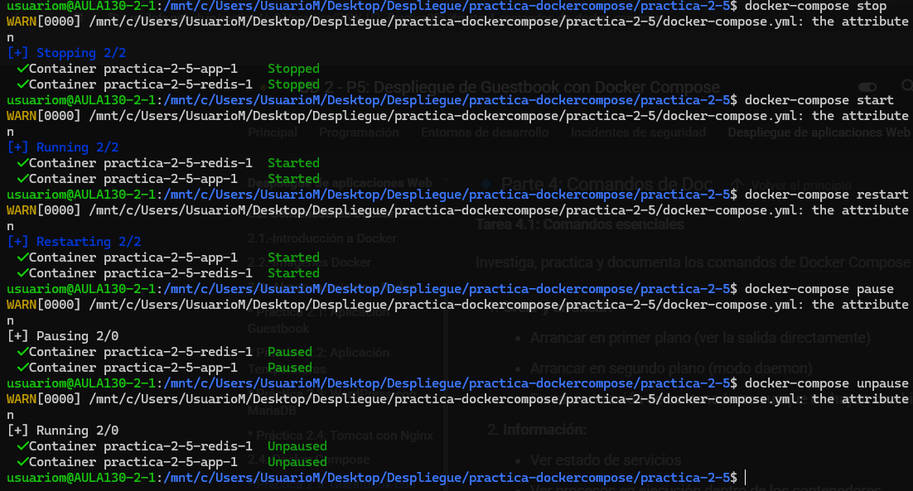

4. **Logs:**
   - Ver logs de todos los servicios: `docker-compose logs`
   - Ver logs de un servicio específico: `docker-compose logs app`
   - Seguir logs en tiempo real (modo follow): `docker-compose logs -f`

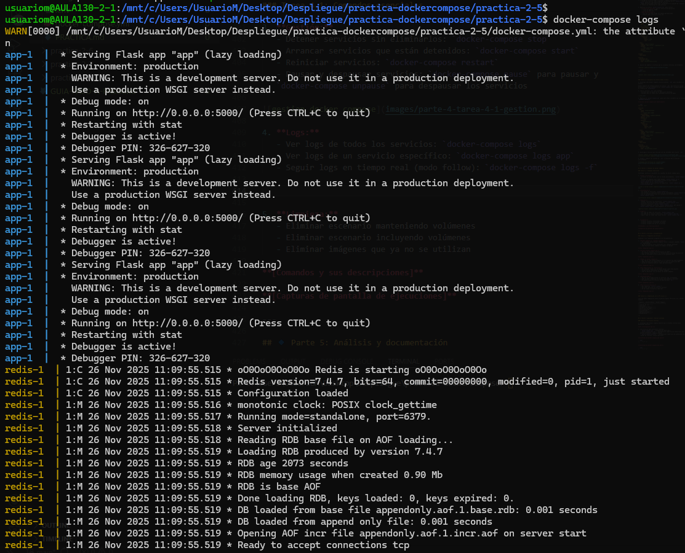
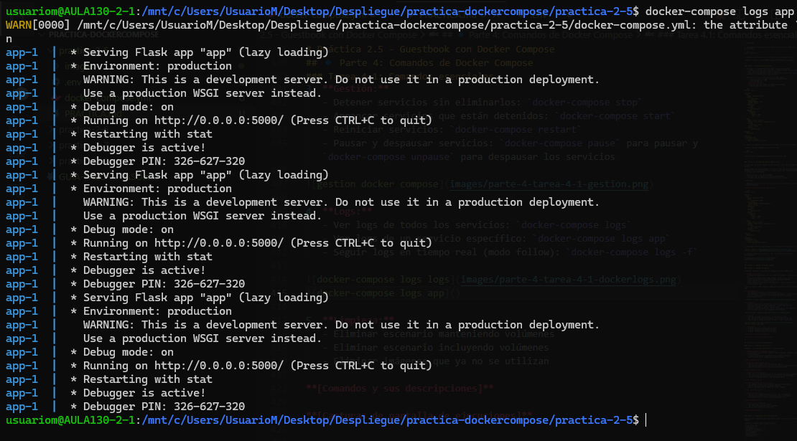
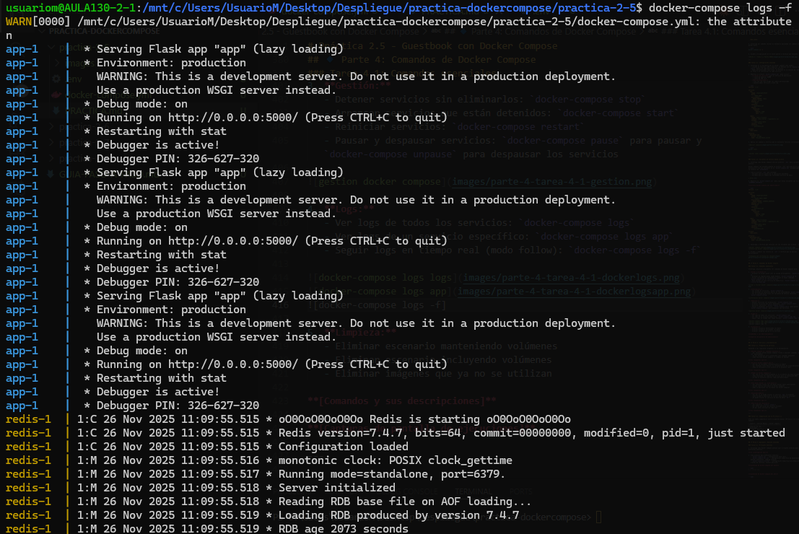

5. **Limpieza:**
   - Eliminar escenario manteniendo volúmenes: `docker-compose down`
   - Eliminar escenario incluyendo volúmenes: `docker-compose down -v`
   - Eliminar imágenes que ya no se utilizan:
      - `docker compose down --rmi local -v` (con este comando bajo los contenedores y borro las imagenes locales que han sido creadas por este proyecto)
      - `docker image prune` (el mas comun y seguro porque elimina solamente las imagenes "dangling", sin tag o huerfanas)
      - `docker image prune -a` (el mas agresivo porque borra TODAS las imagenes que ningun contenedor este usando, incluyendo las que tienen tag y las que se usaban en un proyecto que ya no este corriendo)

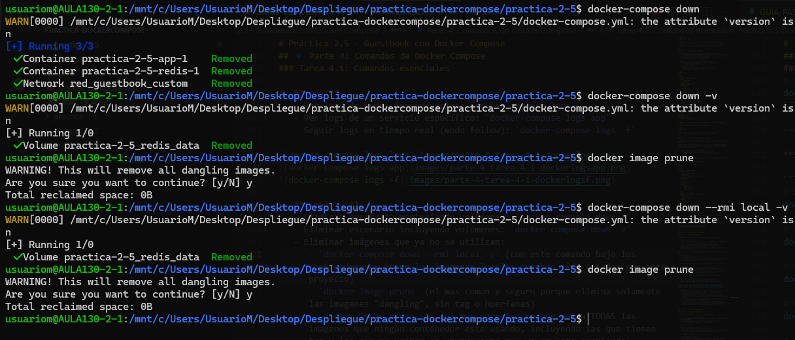

---

## 🔹 Parte 5: Análisis y documentación

### Tarea 5.1: Preguntas de análisis

Responde a las siguientes preguntas en tu documentación:

1. **Docker Compose vs. comandos manuales:**
   - ¿Qué ventajas ofrece Docker Compose frente a ejecutar comandos `docker run` manualmente?: una de las grandes ventajas es la automatizacion que ejecucion de contenedores con las configuraciones que queramos para reproducirlas en cualquier maquina de forma automatica. Y permite orquestar todas las dependencias que tienen los servicios entre si, crea los redes y dns internos de forma automatica, y todo de forma sencilla. 
   - ¿En qué escenarios sería preferible usar comandos manuales?: cuando estemos haciendo pruebas rapidas de un solo contenedor en proyectos de 1 persona, o un debugging en especifico, o para explorar o aprender.
   - ¿Cómo facilita Docker Compose el trabajo en equipo?: el docker compose es muy util en proyectos donde van a trabajr diferentes personas, debido a que cada usuario hace un docker-compose y simplemente se descargaran los mismos entornos y imagenes que el resto de su equipo.

2. **Archivo docker-compose.yml:**
   - ¿Por qué se considera "Infrastructure as Code"? => porque permite definir una infraestructura que se puede automatizar y CI/CD con codigo declarativo, que se puede versionar, revisar y auditar de forma sencilla.
   - ¿Qué ventajas tiene definir la infraestructura de forma declarativa? => se especifica QUE QUIERO, y no el COMO HACERLO porque es el docker compose el que se encarga de los detalles realmente, es muy legible y a la vez mantenible.
   - ¿Cómo se versionaría este archivo en un proyecto real?
      - Se guarda en el repositroio git del proyecto, y se crean branches para cambios, se revisan cambios con PR, y se definen versiones con git tags.
      - Y se definen diferentes docker-compose, para desarrollo con .dev.yml o para produccion con .prod.yml.
      - Tambien se pueden crear imagenes del codigo y versionarlas, para posteriormente subirse a Docker Hub.

3. **Redes en Docker Compose:**
   - ¿Qué red se crea automáticamente si no se define una explícitamente? => `nombredeldirectorio_default` y de tipo bridge.
   - ¿Cómo funcionan los nombres de servicio para la resolución DNS? => cada servicio es accesible por su nombre de servicio y docker compose configura el dns interno de forma automatica, por ejemplo, el servicio `redis` es accesible como `redis` desde `app` (o si se especifica tambien se puede usar el nombre del contenedor)
   - ¿Cuándo es necesario definir redes personalizadas? => cuando se necesitan multiples redes aisladas, o para separar el frontend, backend y base de datos con una buena seguridad.

4. **Volúmenes Docker vs. bind mount:**
   - ¿Qué ventajas tienen los volúmenes Docker sobre bind mounts? => la gran ventaja es que son gestionados completamente por docker, ademas que son portables entre sistemas (cualquierea), ademas tiene un mejor rendimiento y son mas seguros. Tambien se pueden respaldar/restaurar facilmente y funcionan mejor en produccion debido a ese rendimineto y seguridad que proporcionan.
   - ¿Cuándo usarías bind mount en Docker Compose? => en entornos de desarollo donde quiero editar archivos en tiempo real, como por ejemplo, los package.json de proyectos con nodejs.
   - ¿Cómo se gestionan los volúmenes con Docker Compose? => se definen en las sección de `volumes` del archivo .yml, se crean automaticamente al hacer `up` y se preservan al hacer `down` sin embargo, se eliminan si hacemos `down -v`

5. **Escalabilidad:**
   - ¿Por qué no se puede escalar el servicio `app` fácilmente? => porque tiene un mapeo del puerto fijo (9090:5000) lo que generaria conflictos al intentar levantar por ejemplo, 3 aplicaicones en el mismo puerto...
   - ¿Cómo se podría modificar el archivo para permitir escalado? => se eliminaria el mapeo de puerto fijo, y se usarian puertos aleatorios o sin publicar. Ademas seria interesante añadir un balanceador de carga, para que reciba trafico y lo distribuya a las instancias. El balancedor lo que hace es recibir TODO EL TRAFICO en un puerto y lo reparte entre todas las replicas del servicio.
   - ¿Se puede escalar el servicio de base de datos `db`? => no se podria escalar facilmente, debido a que redis es un servicio stateful (no es stateless como una web, api, nginx...). No se puede escalar simplemente con `--scale redis=3`, porque guardan datos. Si se quiere escalar se necesitaria configurar redis cluster o sentinel.

6. **Políticas de reinicio:**
   - ¿Qué significa `restart: always`? => singifica que el contenedor siempre se reinicia si se detiene, incluso despues de reiniciar el docker o el sistema.
   - ¿Qué otras políticas de reinicio existen?
      - `no`: No reiniciar automaticamente (por defecto)
      - `on-failure`: reiniciar solamente si el contenedor falla (exit code != 0)
      - `on-failure:3`: reiniciar maximo 3 veces si falla
      - `unless-stopped`: siempre se reinicia excepto si se detuvo manualmente
   - ¿En qué casos utilizarías cada una?
      - `always`: servicios criticos que siempre deben estar corriendo
      - `no`: contenedores temporales, por ejemplo pruebas
      - `on-failure`: aplicaciones que pueden fallar pero deberian recuperarse
      - `unless-stopped`: servicios que deben correr pero respetan paradas manuales.

---

### Tarea 5.2: Comparación con la Práctica 2.1

Crea una tabla comparativa entre la gestión manual (Práctica 2.1) y Docker Compose:

| Aspecto | Gestión Manual | Docker Compose |
|---------|----------------|----------------|
| **Creación de red** | Comando manual: `docker network create` | Automática, creada al hacer `up` |
| **Despliegue** | Múltiples comandos `docker run`, orden manual | Un solo comando: `docker-compose up -d` |
| **Variables de entorno** | `-e` en cada comando, difícil de mantener | Definidas en el archivo, centralizadas |
| **Gestión de volúmenes** | `-v` en cada comando, deben recordarse | Definidos en el archivo, gestionados automáticamente |
| **Inicio/detención** | `docker start/stop` para cada contenedor | `docker-compose start/stop` para todos |
| **Escalabilidad** | Muy difícil, requiere scripts personalizados | Comando `--scale`, más sencillo |
| **Reproducibilidad** | Baja: depende de documentación y memoria | Alta: todo definido en archivo versionable |
| **Documentación** | Comandos dispersos, wiki o readme | El propio docker-compose.yml documenta |
| **Trabajo en equipo** | Difícil compartir comandos exactos | Fácil: compartir un archivo |
| **Mantenimiento** | Complejo, propenso a errores | Simple, cambios centralizados |

---

## 🔹 Parte 6 (opcional): Gestión avanzada

### Tarea 6.1: Múltiples entornos

1. Investiga cómo Docker Compose permite usar múltiples archivos para diferentes entornos.

Añadiendo el flag `-f` se puede hacer un docker compose de un archivo en especifico. Por ejemplo para development .dev.yml o produccion .prod.yml

2. Crea archivos para diferentes entornos:
   - `docker-compose.yml` - Configuración base común
   - `docker-compose.dev.yml` - Configuración específica de desarrollo
   - `docker-compose.prod.yml` - Configuración específica de producción

**[Contenido de docker-compose.yml base]**

```yaml
version: '3.8'

services:
  app:
    image: iesgn/guestbook
    environment:
      REDIS_SERVER: redis
    depends_on:
      - redis

  redis:
    image: redis:7-alpine
    command: redis-server --appendonly yes
    volumes:
      - redis_data:/data

volumes:
  redis_data:
```

**[Contenido de docker-compose.dev.yml]**

```yaml
version: '3.8'

services:
  app:
    ports:
      - "8080:5000"
    environment:
      DEBUG: "true"
    restart: "no"

  redis:
    ports:
      - "6379:6379"
    restart: "no"
```

**[Contenido de docker-compose.prod.yml]**

```yaml
version: '3.8'

services:
  app:
    ports:
      - "80:5000"
    restart: always
    deploy:
      resources:
        limits:
          memory: 256M
          cpus: '0.5'
        reservations:
          memory: 128M
          cpus: '0.25'

  redis:
    restart: always
    deploy:
      resources:
        limits:
          memory: 512M
          cpus: '1.0'
```

3. Investiga la sintaxis del comando para usar múltiples archivos simultáneamente.


```bash
# Levantar el contenedor en desarrollo
docker-compose -f docker-compose.yml -f docker-compose.dev.yml up -d
```

```bash
# Levantar el contenedor en producción
docker-compose -f docker-compose.yml -f docker-compose.prod.yml up -d
```

```bash
# Con esto vemos la configuracion final en entorno desarrollo
docker-compose -f docker-compose.yml -f docker-compose.dev.yml config
```

```bash
# Detenemos el contenedor de desarrollo
docker-compose -f docker-compose.yml -f docker-compose.dev.yml down

```

4. Prueba a desplegar con diferentes combinaciones de archivos.

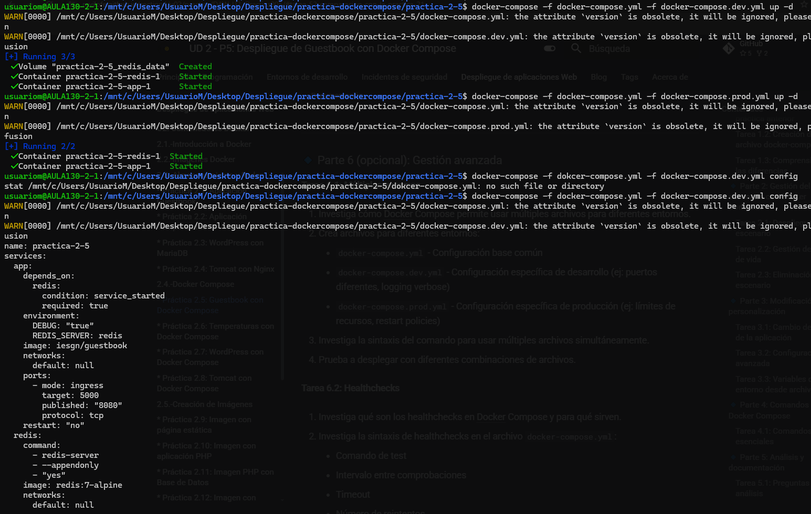
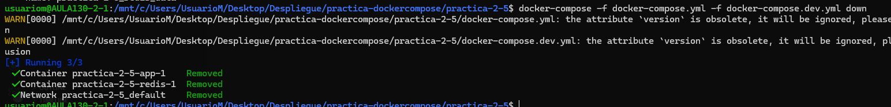

---

### Tarea 6.2: Healthchecks

1. Investiga qué son los healthchecks en Docker Compose y para qué sirven.

Los healthchekcs permiten a docker verificar automaticmaente si un contenedor esta sano o no. Si falla, podemos poner para que se reinicie automaticamente.

2. Investiga la sintaxis de healthchecks en el archivo `docker-compose.yml`:
   - Comando de test: `test` (es el comando que ejecutamos para verificar la salud)
   - Intervalo entre comprobaciones: `interval` (le decimos cada cuanto queremos verificar,  por default es 30 segundos)
   - Timeout: `timeout` (el tiempo maximo para el test (por default 30s))
   - Número de reintentos: `start_period`, el tiemppo de gracia al inicio (default 0s)

3. Añade un healthcheck al servicio de Redis que verifique su disponibilidad.

`docker-compose.yml`
```yaml
version: '3.8'

services:
  app:
    image: iesgn/guestbook
    environment:
      REDIS_SERVER: redis
    depends_on:
      redis:
        condition: service_healthy
    healthcheck:
      test: ["CMD", "curl", "-f", "http://localhost:5000"]
      interval: 30s
      timeout: 10s
      retries: 3
      start_period: 40s

  redis:
    image: redis:7-alpine
    command: redis-server --appendonly yes
    volumes:
      - redis_data:/data
    healthcheck:
      test: ["CMD", "redis-cli", "ping"]
      interval: 10s
      timeout: 5s
      retries: 5
      start_period: 30s

volumes:
  redis_data:
```

4. Investiga el comando para ver el estado de salud de los servicios.

5. Verifica que el healthcheck funciona correctamente.

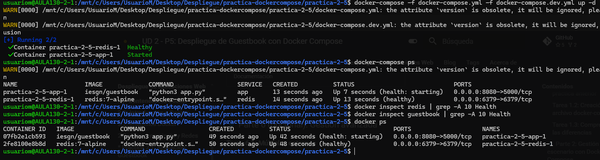
