# UD 2 - Práctica 6: Despliegue de Temperaturas con Docker Compose

---

## 🔹 Parte 1: Creación del archivo docker-compose.yml

### Tarea 1.1: Estructura básica

Crea un directorio `~/temperaturas_compose` y desarrolla un archivo `docker-compose.yml` que contenga:

**Servicio Frontend:**
- Imagen: `iesgn/temperaturas_frontend`
- Puerto del host mapeado al puerto 3000 del contenedor
- Variable de entorno indicando la ubicación del backend (nombre:puerto)
- Dependencia explícita del servicio backend
- Política de reinicio

**Servicio Backend:**
- Imagen: `iesgn/temperaturas_backend`
- Política de reinicio
- Sin exposición de puerto al host (solo comunicación interna)

Plantilla de estructura:
```yaml
version: '3.1'

services:
  ???????????:
    ....
    ....
    restart: always
    ports:
      - 8081:?????
    environment:
      TEMP_SERVER: temperaturas-backend:5000
    depends_on:
      - backend

  ???????????:
    ....
    ....
    restart: always
```

**Archivo docker-compose.yml creado:**

```yaml
version: '3.1'

services:
  frontend:
    container_name: temperaturas-frontend
    image: iesgn/temperaturas_frontend
    restart: always
    ports:
      - 8081:3000
    environment:
      TEMP_SERVER: backend:5000
    depends_on:
      - backend

  backend:
    container_name: temperaturas-backend
    image: iesgn/temperaturas_backend
    restart: always
```

---

**Preguntas de análisis:**

1. ¿Por qué el frontend depende del backend?
- El frontend depende del backend porque necesita conectarse a él para obtener los datos de temperatura de los municipios. Sin el backend, el frontend no tendría de dónde obtener la información que debe mostrar al usuario. La directiva `depends_on` asegura que Docker Compose intente iniciar primero el backend antes que el frontend.

---

2. ¿Qué indica la variable de entorno del servidor backend?

- La variable de entorno `TEMP_SERVER` indica al frontend la dirección donde puede encontrar el backend. El formato es `nombre_servicio:puerto`, en este caso `backend:5000`. Docker Compose crea automáticamente un DNS interno que resuelve el nombre del servicio "backend" a la IP del contenedor correspondiente, permitiendo la comunicación entre los servicios.

---

3. ¿Por qué el backend no expone puertos al host?

El backend no expone puertos al host porque no necesita ser accesible desde fuera de Docker. Solo el frontend necesita comunicarse con él, y esto se hace a través de la red interna que Docker Compose crea automáticamente. Esto mejora la seguridad ya que el backend solo es accesible desde dentro de la red de Docker, no desde el exterior.

---

### Tarea 1.2: Comprensión de dependencias

1. Investiga la documentación de la directiva `depends_on`:
   - ¿Garantiza que el backend esté completamente inicializado antes de que arranque el frontend? => NO garantiza que el backend esté completamente inicializado y listo para recibir peticiones antes de arrancar el frontend.
   - ¿Solo controla el orden de inicio de contenedores? => si, es decir, Docker Compose iniciará primero el backend y luego el frontend.
   - ¿Qué limitaciones tiene? => La limitación principal es que `depends_on` no espera a que el servicio dependiente esté "listo" (healthy), solo espera a que el contenedor haya sido creado e iniciado. Esto significa que el frontend podría intentar conectarse al backend antes de que este esté completamente operativo.
  
Para solucionar esa limitacion del depends_on, se puede solucionar usando healthchecks combinados con la condición `service_healthy` en versiones más recientes de Docker Compose. 

---

2. Experimenta con diferentes configuraciones:
   - Prueba usando el nombre del contenedor en la variable de entorno
   - Prueba usando el nombre del servicio en la variable de entorno
   - Verifica que ambas configuraciones funcionen correctamente

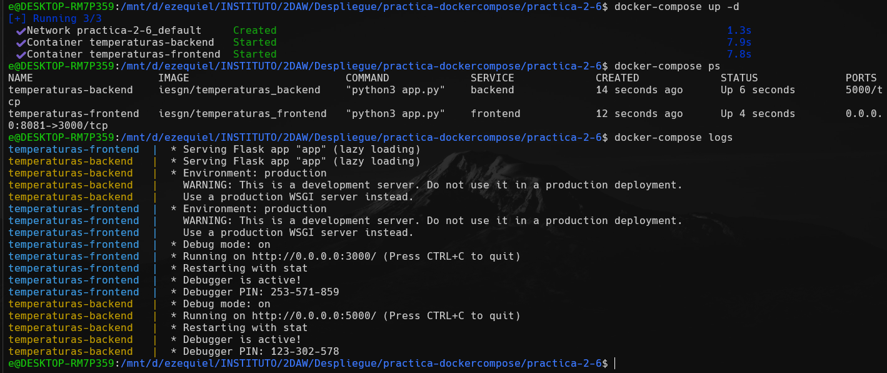

Ambas configuraciones permiten que el frontend se conecte correctamente al backend porque Docker Compose crea entradas DNS tanto para el nombre del servicio como para el nombre del contenedor dentro de la red interna.

---

3. Reflexiona sobre las mejores prácticas y razonamiento

En mi opinion creo que la mejor práctica realmnte es usar el nombre del servicio (backend) en lugar del nombre del contenedor (temperaturas-backend) porque el nombre del servicio es mas flexible, y no cambia si dedicamos no usar el `container_name`.

Cuando escalemos servicios no podemos usar `container_name` porque cada réplica necesita un nombre único. El nombre del servicio funciona con escalado porque Docker balancea automáticamente las peticiones.

Es más limpio y sigue las convenciones de Docker Compose. Facilita la portabilidad del archivo docker-compose.yml entre diferentes entornos.

---

## 🔹 Parte 2: Despliegue y gestión

### Tarea 2.1: Despliegue del escenario

1. Despliega la aplicación con Docker Compose

```bash
docker-compose up -d
```


---

2. Observa el orden de creación de servicios—¿se crea primero el backend?

Sí, gracias a la directiva `depends_on` en el servicio frontend, Docker Compose crea e inicia primero el contenedor del backend y luego el del frontend. En la salida del comando se puede observar que primero aparece el mensaje de creación del backend y después el del frontend.

---

3. Verifica los contenedores en ejecución

```bash
docker-compose ps
```


---

4. Accede a la aplicación (http://localhost:8081)

5. Busca varios municipios

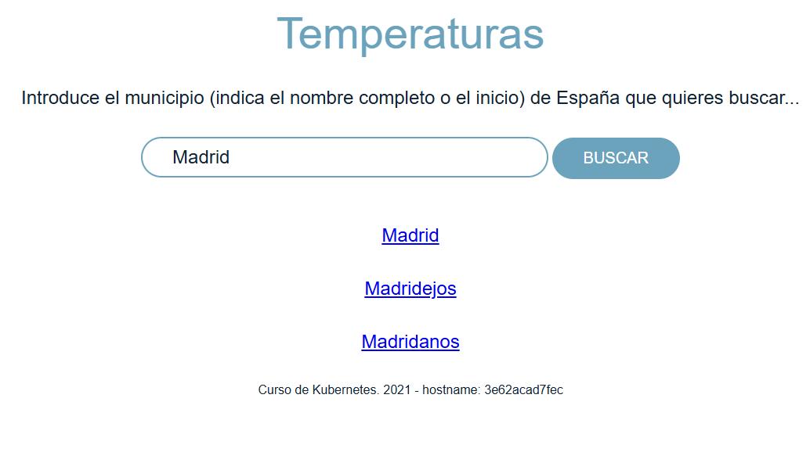

---

### Tarea 2.2: Análisis de logs

1. Visualiza los logs de ambos servicios simultáneamente

2. Visualiza solo los logs del frontend

3. Visualiza solo los logs del backend

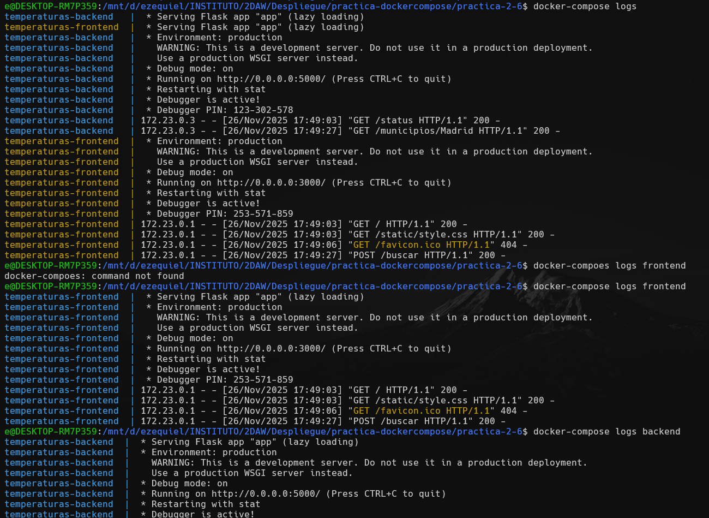

4. En los logs del frontend, localiza las peticiones HTTP al backend

**Captura de pantalla:**


---

5. En los logs del backend, identifica las respuestas enviadas

temperaturas-backend  | 172.23.0.3 - - [26/Nov/2025 17:49:27] "GET /municipios/Madrid HTTP/1.1" 200 -

---

### Tarea 2.3: Pruebas de resiliencia

1. Detén solo el servicio backend

```bash
docker-compose stop backend
```

---

2. Intenta acceder a la aplicación—¿qué ocurre?

**Respuesta:**

Al intentar acceder a la aplicación después de detener el backend, el frontend sigue funcionando y la página web se carga, pero cuando intento buscar un municipio aparece un error de conexión. Esto se debe a que el frontend no puede conectarse al backend para obtener los datos de temperatura. La aplicación frontend está activa pero no puede cumplir su función principal sin el backend.

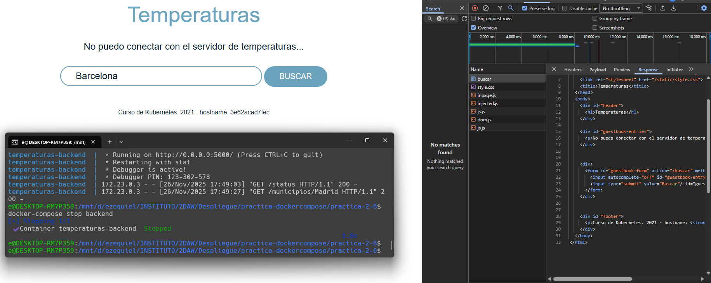

---

3. Observa los logs del frontend—¿qué errores aparecen?

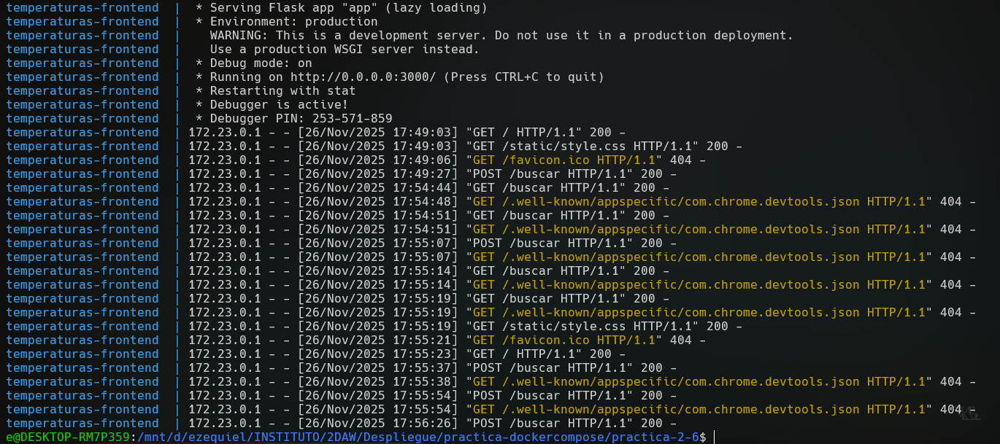

4. Reinicia el backend

```bash
docker-compose start backend
```

---

5. Verifica que la aplicación funciona sin reiniciar el frontend

**Respuesta:**

Después de reiniciar el backend, la aplicación vuelve a funcionar correctamente sin necesidad de reiniciar el frontend. Esto demuestra la resiliencia de la arquitectura de microservicios: el frontend puede recuperarse automáticamente cuando el backend vuelve a estar disponible, sin necesidad de ser reiniciado.

**Captura de pantalla:**

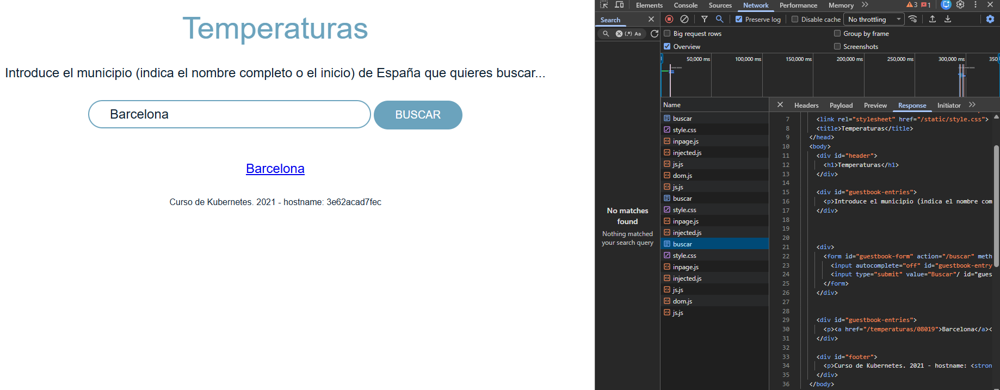

---

## 🔹 Parte 3: Escalado de microservicios

### Tarea 3.1: Escalado del backend

1. Investiga el comando de escalado de Docker Compose

`docker-compose up -d --scale nombre_servicio=numero_replicas`

2. Escala el servicio backend a 3 instancias
```bash
docker-compose up -d --scale backend=3
```

**Nota:** Primero tuve que eliminar `container_name: temperaturas-backend` del archivo docker-compose.yml porque no se pueden escalar servicios que tienen nombres de contenedor fijos.

---

3. Verifica que las tres instancias están en ejecución

```bash
docker-compose ps
```

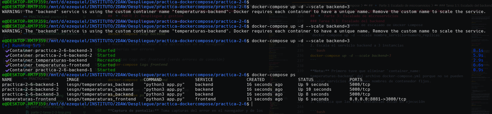

---

4. Realiza múltiples búsquedas en la aplicación

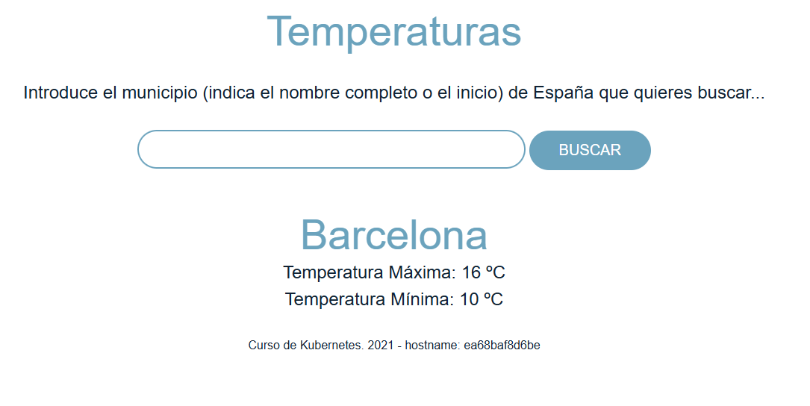

---

5. Investiga y responde:
   - ¿Las peticiones se distribuyen entre las instancias? => Sí, las peticiones se distribuyen entre las tres instancias del backend. Esto se puede verificar observando los logs de cada réplica del backend, donde se ve que diferentes instancias procesan diferentes peticiones.
   - ¿Por qué sí o por qué no? => Esto funciona porque Docker Compose utiliza un mecanismo de balanceo de carga basado en DNS round-robin. Cuando el frontend hace una petición a "backend:5000", el DNS interno de Docker devuelve las IPs de las diferentes réplicas de forma rotativa, distribuyendo así la carga entre todas las instancias disponibles.
   - ¿Qué mecanismo de Docker gestiona esto? => Este balanceo es automático y no requiere configuración adicional, lo que facilita enormemente el escalado horizontal de servicios en Docker Compose.

---

### Tarea 3.2: Escalado del frontend

1. Intenta escalar el frontend a 2 instancias usando el comando de escalado

```bash
docker-compose up -d --scale frontend=2
```

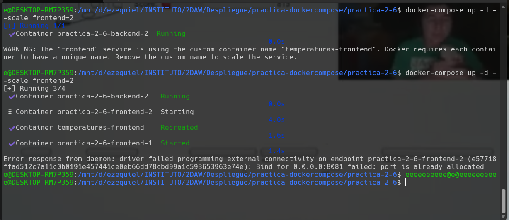

---

2. Documenta los problemas que aparecen

**Problemas encontrados:**

Al intentar escalar el frontend aparecen dos problemas:

1. **Error de puerto ocupado**: No se pueden crear múltiples instancias porque todas intentan usar el mismo puerto del host (8081). Solo un contenedor puede vincularse a un puerto específico del host a la vez.

2. **Conflicto de nombre de contenedor**: Si tenemos `container_name` definido, Docker no puede crear múltiples contenedores con el mismo nombre.

El mensaje de error indica algo como: "port is already allocated" o "container name already in use".

---

3. Investiga cómo habilitar el escalado del frontend modificando el mapeo de puertos:
   - Investiga la especificación de rangos de puertos
   - Modifica la configuración del servicio frontend
   - Asegúrate de que no haya nombres de contenedor fijos

**Configuración modificada:**

```yaml
version: '3.1'

services:
  frontend:
    # Se elimina container_name para permitir múltiples instancias
    image: iesgn/temperaturas_frontend
    restart: always
    ports:
      - "8081-8083:3000"  # Rango de puertos en el host
    environment:
      TEMP_SERVER: backend:5000
    depends_on:
      - backend

  backend:
    # También se elimina el container_name del backend
    image: iesgn/temperaturas_backend
    restart: always
```

---

4. Escala el frontend a múltiples instancias y verifica

```bash
docker-compose down
docker-compose up -d --scale frontend=2 --scale backend=3
```

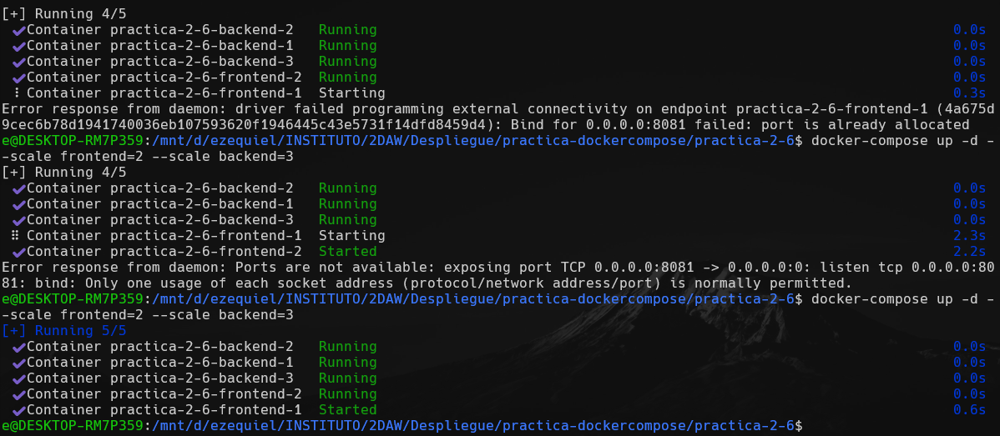

---

5. Identifica qué puertos del host ocupa cada instancia

Usando el comando `docker-compose ps` o `docker ps` puedo ver que Docker asigna automáticamente puertos del rango especificado (8081-8083) a cada instancia del frontend:
- Primera instancia: 8081
- Segunda instancia: 8082

Cada instancia es accesible desde su puerto correspondiente en localhost.

**Captura de pantalla:**

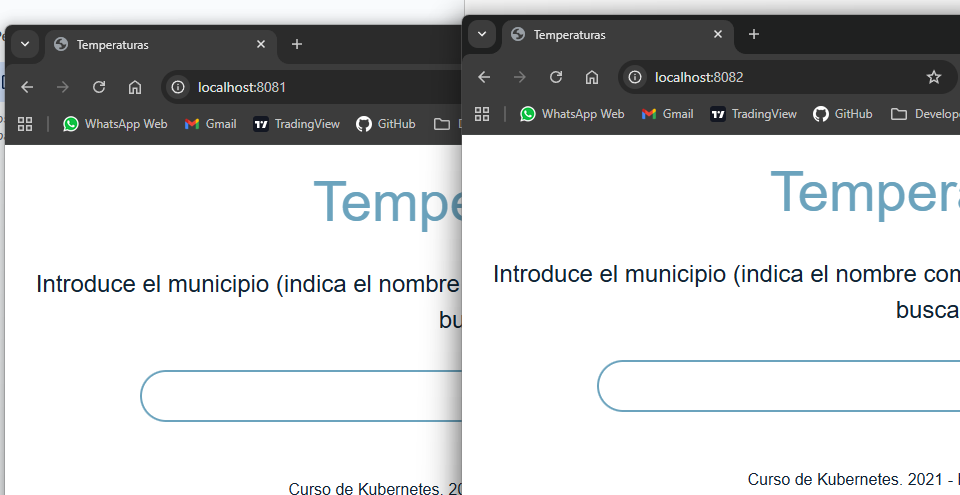

---

## 🔹 Parte 4: Configuración avanzada

### Tarea 4.1: Límites de recursos

1. Investiga la documentación de límites de recursos en Docker Compose

- https://docs.docker.com/compose/compose-file/deploy/#resources
- https://docs.docker.com/compose/compose-file/05-services/#deploy

---

2. Añade a `docker-compose.yml`:

**Frontend:**
- Límite de CPU: 0.5
- Límite de memoria: 128M
- Reserva de CPU: 0.25
- Reserva de memoria: 64M

**Backend:**
- Límite de CPU: 0.5
- Límite de memoria: 128M
- Configuración para 2 réplicas

**Archivo docker-compose.yml modificado:**

```yaml
version: '3.1'

services:
  frontend:
    image: iesgn/temperaturas_frontend
    restart: always
    ports:
      - "8081-8083:3000"
    environment:
      TEMP_SERVER: backend:5000
    depends_on:
      - backend
    deploy:
      resources:
        limits:
          cpus: '0.5'
          memory: 128M
        reservations:
          cpus: '0.25'
          memory: 64M

  backend:
    image: iesgn/temperaturas_backend
    restart: always
    deploy:
      replicas: 2
      resources:
        limits:
          cpus: '0.5'
          memory: 128M
```

---

3. Despliega con los cambios y verifica el consumo de recursos usando comandos Docker

**Comandos usados:**
```bash
docker-compose up -d
docker stats
```

**Captura de pantalla:**

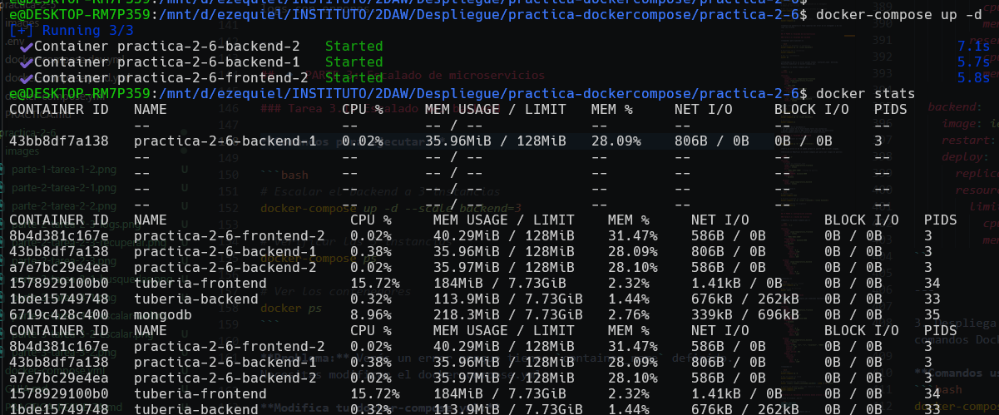

---

### Tarea 4.2: Healthchecks

1. Investiga la sintaxis de healthcheck en Docker Compose

**Enlaces consultados:**

- https://docs.docker.com/compose/compose-file/05-services/#healthcheck
- https://docs.docker.com/engine/reference/builder/#healthcheck

---

2. Añade al servicio backend un healthcheck que:
   - Verifique disponibilidad del puerto 5000
   - Se ejecute cada 30 segundos
   - Tenga timeout de 3 segundos
   - Permita 3 reintentos
   - Espere 40 segundos antes del primer chequeo (start_period)

**Configuración añadida:**

```yaml
version: '3.1'

services:
  frontend:
    image: iesgn/temperaturas_frontend
    restart: always
    ports:
      - "8081-8083:3000"
    environment:
      TEMP_SERVER: backend:5000
    depends_on:
      - backend
    deploy:
      resources:
        limits:
          cpus: '0.5'
          memory: 128M
        reservations:
          cpus: '0.25'
          memory: 64M

  backend:
    image: iesgn/temperaturas_backend
    restart: always
    healthcheck:
      test: ["CMD", "nc", "-z", "localhost", "5000"]
      interval: 30s
      timeout: 3s
      retries: 3
      start_period: 40s
    deploy:
      replicas: 2
      resources:
        limits:
          cpus: '0.5'
          memory: 128M
```

---

3. Verifica el estado de salud con comandos de Docker Compose

```bash
docker-compose ps
```

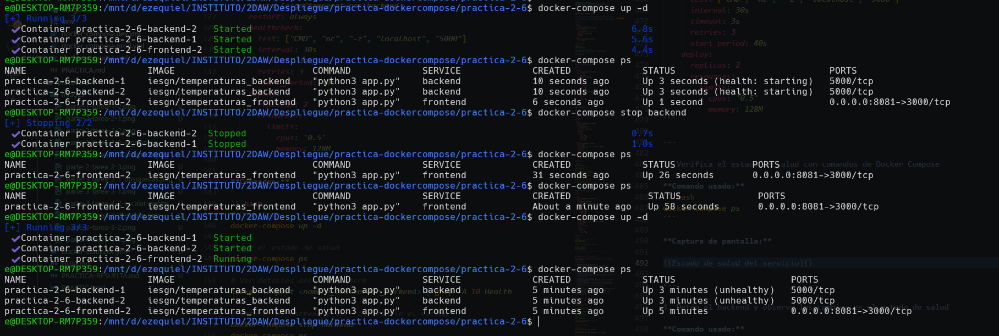

---

4. Detén el backend y observa los cambios en el estado de salud

**Comando usado:**
```bash
docker-compose stop backend
docker-compose ps
```


---

### Tarea 4.3: Variables de entorno desde archivo

1. Crea un archivo `.env` con:
   - Puerto del frontend
   - Hostname del backend
   - Puerto del backend

```env
FRONTEND_PORT=8081
BACKEND_HOST=backend
BACKEND_PORT=5000
```

---

2. Modifica `docker-compose.yml` usando sintaxis `${VARIABLE}`:

```yaml
services:
  ???????????:
    ports:
      - "${FRONTEND_PORT}:3000"
    ???????????:
      TEMP_SERVER: ${BACKEND_HOST}:${BACKEND_PORT}
```

**Archivo docker-compose.yml modificado:**

```yaml
version: '3.1'

services:
  frontend:
    image: iesgn/temperaturas_frontend
    restart: always
    ports:
      - "${FRONTEND_PORT}:3000"
    environment:
      TEMP_SERVER: ${BACKEND_HOST}:${BACKEND_PORT}
    depends_on:
      - backend
    deploy:
      resources:
        limits:
          cpus: '0.5'
          memory: 128M
        reservations:
          cpus: '0.25'
          memory: 64M

  backend:
    image: iesgn/temperaturas_backend
    restart: always
    healthcheck:
      test: ["CMD", "nc", "-z", "localhost", "5000"]
      interval: 30s
      timeout: 3s
      retries: 3
      start_period: 40s
    deploy:
      replicas: 2
      resources:
        limits:
          cpus: '0.5'
          memory: 128M
```

---

3. Despliega y verifica funcionalidad con variables de entorno

**Comando usado:**
```bash
docker-compose down
docker-compose up -d
```

**Captura de pantalla:**

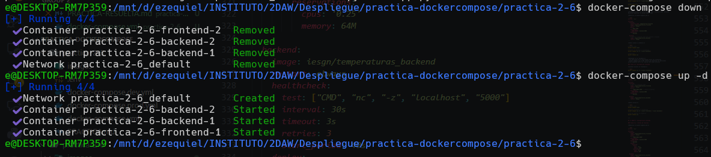

---

4. Experimenta cambiando valores del `.env` sin modificar `docker-compose.yml`

Cambié el puerto del frontend en el archivo .env de 8081 a 8082:
```env
FRONTEND_PORT=8082
BACKEND_HOST=backend
BACKEND_PORT=5000
```

**Resultado:**

Después de ejecutar `docker-compose down` y `docker-compose up -d`, la aplicación ahora está disponible en http://localhost:8082 en lugar de 8081. Esto demuestra la flexibilidad de usar variables de entorno: puedo cambiar la configuración sin tocar el archivo docker-compose.yml, lo que facilita el despliegue en diferentes entornos (desarrollo, producción, etc.).

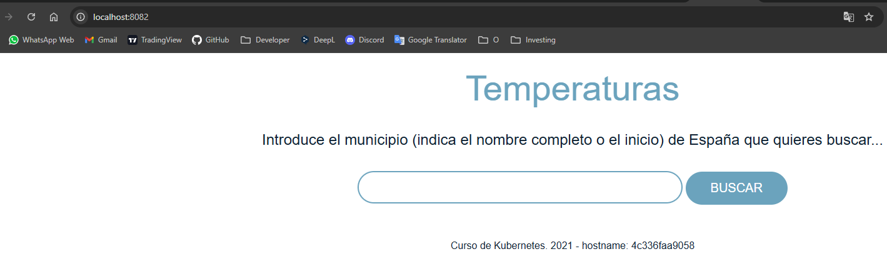

---

## 🔹 Parte 5: Análisis y documentación

### Tarea 5.1: Preguntas de análisis

1. **Comparación con la práctica anterior:**
   - ¿Qué comandos de la Práctica 2.2 reemplaza Compose?
   - ¿Es más fácil gestionar esta aplicación con Compose?
   - ¿Qué ventajas adicionales existen?

En esta práctica, Docker Compose sustituye varios comandos que antes hacíamos a mano. Ya no hace falta crear la red con docker network create, ni lanzar cada contenedor con sus docker run llenos de parámetros, ni pararlos o borrarlos uno por uno. Con un docker-compose up -d se levanta todo y con docker-compose down se limpia.

En general, gestionar la aplicación con Compose es bastante más cómodo, porque todo queda escrito en el archivo YAML y no hace falta memorizar puertos, variables o dependencias.

Además, tiene algunas ventajas extra: es fácil reproducir el despliegue en cualquier máquina, se puede versionar el archivo en Git, permite escalar servicios con un solo comando, facilita ver los logs de todos los contenedores y ayuda a controlar el orden en que se inicia cada servicio. También hace más sencilla la gestión de variables de entorno usando un archivo .env.

---

2. **Dependencias entre servicios:**
   - ¿Qué distingue a `depends_on` de `links`?
   - ¿`depends_on` garantiza que el servicio esté listo para recibir peticiones?
   - ¿Cómo podrían los healthchecks mejorar esto?

La principal diferencia es que `links` es una característica obsoleta (deprecated) que se usaba en versiones antiguas de Docker para conectar contenedores y crear alias de red. En cambio, `depends_on` es la forma moderna de especificar dependencias entre servicios y solo controla el orden de inicio.

No, `depends_on` NO garantiza que el servicio esté listo para recibir peticiones. Solo asegura que el contenedor dependiente (backend) se inicie antes que el dependiente (frontend), pero no espera a que el servicio dentro del contenedor esté completamente operativo. El frontend podría intentar conectarse al backend antes de que este esté listo para responder.

Los healthchecks mejoran esto significativamente. Con healthchecks podemos:
- Definir una condición `depends_on: backend: condition: service_healthy`
- Esto hace que el frontend espere hasta que el healthcheck del backend reporte estado "healthy"
- Asegura que el backend esté realmente operativo antes de que arranque el frontend
- Reduce errores de conexión durante el inicio de la aplicación

---

3. **Arquitectura de microservicios:**
   - ¿Qué ventajas tiene separar frontend y backend?
   - ¿Cómo facilita Compose el desarrollo de microservicios?
   - ¿Qué ocurre si falla el backend? ¿Y si falla el frontend?

Separar frontend y backend tiene varias ventajas: se pueden escalar de manera independiente según la carga, los equipos pueden trabajar por separado, cada parte puede usar la tecnología que más convenga, es más fácil de mantener y si un servicio falla, el otro puede seguir funcionando en parte.

Docker Compose ayuda mucho con los microservicios porque conecta automáticamente los servicios entre sí, permite configurarlos todos en un mismo archivo, facilita probar la arquitectura completa en local, ayuda a escalar y organiza las dependencias de manera clara.

Si falla el backend, el frontend sigue cargando, pero algunas funciones como búsquedas no van a funcionar y el usuario verá errores de conexión. Cuando el backend vuelva, el frontend puede recuperarse.
Si falla el frontend, el backend sigue funcionando normalmente, pero los usuarios no pueden usar la interfaz web. Se podría levantar otra instancia del frontend sin afectar al backend.

---

4. **Escalado:**
   - ¿Por qué es más fácil escalar el backend que el frontend?
   - ¿Cómo se distribuirían las peticiones entre múltiples backends?
   - ¿Sería necesario balanceo de carga?

Escalar el backend es más fácil porque no necesita exponer puertos al host y varias instancias pueden usar el mismo puerto interno sin problemas. En cambio, el frontend es más complicado, ya que solo un contenedor puede usar el puerto que se expone al host (8081), así que habría que usar rangos de puertos o dejar que Docker asigne uno aleatorio.

Las peticiones se reparten entre los backends usando el DNS interno de Docker. Cuando el frontend pide algo a "backend:5000", Docker va rotando entre las distintas réplicas, haciendo un balanceo básico automáticamente.

No hace falta un balanceador extra para pruebas o desarrollo, pero en producción podría ser útil usar uno más avanzado, como nginx o Traefik, que permita algoritmos de balanceo más sofisticados, chequeos de salud y monitoreo.

---

### Tarea 5.2: Tabla comparativa

Crea una tabla comparativa:

| Aspecto | Temperaturas Manual | Temperaturas Compose |
|---------|--------------------|-----------------------|
| Comandos de despliegue | Múltiples comandos `docker run` con muchos parámetros para cada contenedor, crear red manualmente | Un solo comando `docker-compose up -d` |
| Gestión de red | Crear red manualmente con `docker network create` y especificarla en cada `docker run` | Red creada automáticamente por Compose, todos los servicios se conectan automáticamente |
| Variables de entorno | Pasar con `-e VARIABLE=valor` en cada comando `docker run` | Definidas en docker-compose.yml o en archivo .env, más organizadas y fáciles de modificar |
| Escalado | Ejecutar múltiples `docker run` manualmente, gestionar nombres únicos y puertos | Comando simple `--scale servicio=N`, Docker gestiona automáticamente nombres y distribución |
| Orden de inicio | Controlar manualmente ejecutando comandos en el orden correcto | Gestionado automáticamente con `depends_on` |
| Logs | Comando `docker logs` para cada contenedor individualmente | `docker-compose logs` muestra todos los servicios a la vez, o filtrar por servicio fácilmente |
