# Práctica 2.7 - WordPress con Docker Compose

---

# 🔹 Parte 1: Despliegue con volúmenes Docker

## Tarea 1.1: Creación del archivo docker-compose.yml

1. Crea un directorio: `~/wordpress_compose`.

2. Investiga en la documentación de Docker Hub las imágenes de WordPress y MariaDB para identificar:
   - Variables de entorno necesarias para WordPress
    - `WORDPRESS_DB_HOST`: Nombre del host de la base de datos
    - `WORDPRESS_DB_USER`: Usuario para conectarse a la base de datos
    - `WORDPRESS_DB_PASSWORD`: Contraseña del usuario de la base de datos
    - `WORDPRESS_DB_NAME`: Nombre de la base de datos a usar
   - Variables de entorno necesarias para MariaDB
      - **WordPress (https://hub.docker.com/_/wordpress):**
        - Variables de entorno principales:
          - Puerto: 80 (HTTP)
          - Directorio de persistencia: `/var/www/html/wp-content` (contiene temas, plugins y archivos multimedia)

      - **MariaDB (https://hub.docker.com/_/mariadb):**
        - Variables de entorno principales:
          - `MYSQL_ROOT_PASSWORD`: Contraseña del usuario root (obligatoria)
          - `MYSQL_DATABASE`: Nombre de la base de datos a crear automáticamente
          - `MYSQL_USER`: Usuario de base de datos a crear
          - `MYSQL_PASSWORD`: Contraseña para el usuario creado
   - Puertos que utilizan => Puerto: 3306 (MySQL/MariaDB)
   - Directorios para persistencia de datos => Directorio de persistencia: `/var/lib/mysql` (almacena todas las bases de datos)

**MariaDB (https://hub.docker.com/_/mariadb):**
- Variables de entorno principales:
  - `MYSQL_ROOT_PASSWORD`: Contraseña del usuario root (obligatoria)
  - `MYSQL_DATABASE`: Nombre de la base de datos a crear automáticamente
  - `MYSQL_USER`: Usuario de base de datos a crear
  - `MYSQL_PASSWORD`: Contraseña para el usuario creado
- Puerto: 3306 (MySQL/MariaDB)

---

3. Crea un archivo `docker-compose.yml` que defina:

   **Servicio de WordPress:**
   - Imagen: `wordpress`
   - Puerto 80 del host mapeado al puerto del contenedor
   - Variables de entorno necesarias para conexión a base de datos
   - Volumen Docker para el contenido de WordPress (`/var/www/html/wp-content`)
   - Dependencia del servicio de base de datos
   - Política de reinicio automático

   **Servicio de MariaDB:**
   - Imagen: `mariadb`
   - Variables de entorno para configuración inicial (base de datos, usuario, contraseñas)
   - Volumen Docker para los datos de la base de datos (`/var/lib/mysql`)
   - Política de reinicio automático

   **Volúmenes:** Define dos volúmenes Docker (uno para WordPress, otro para MariaDB)

**Archivo docker-compose.yml:**

```yaml
version: '3.8'

services:
  wordpress:
    image: wordpress:latest
    container_name: wordpress_app
    restart: always
    ports:
      - "80:80"
    environment:
      WORDPRESS_DB_HOST: mariadb
      WORDPRESS_DB_USER: wordpress_user
      WORDPRESS_DB_PASSWORD: wordpress_pass
      WORDPRESS_DB_NAME: wordpress_db
    volumes:
      - wordpress_data:/var/www/html/wp-content
    depends_on:
      - mariadb

  mariadb:
    image: mariadb:latest
    container_name: mariadb_db
    restart: always
    environment:
      MYSQL_ROOT_PASSWORD: root_password
      MYSQL_DATABASE: wordpress_db
      MYSQL_USER: wordpress_user
      MYSQL_PASSWORD: wordpress_pass
    volumes:
      - mariadb_data:/var/lib/mysql

volumes:
  wordpress_data:
  mariadb_data:
```

4. Analiza y responde:
   - ¿Por qué hay dos volúmenes diferentes? => Hay dos volúmenes diferentes porque cada servicio necesita persistir tipos de datos completamente distintos: Uno para WordPress (contenido del sitio web). Otro para MariaDB (base de datos)
   - ¿Qué datos almacena cada volumen?
    - **wordpress_data**: Almacena todo el contenido de WordPress en `/var/www/html/wp-content`, que incluye:
      - Temas instalados
      - Plugins instalados
      - Imágenes y archivos multimedia subidos
      - Cualquier personalización del sitio

    - **mariadb_data**: Almacena todos los datos de la base de datos en `/var/lib/mysql`, que incluye:
      - Tablas de WordPress (posts, páginas, usuarios, configuración)
      - Datos estructurados del contenido
      - Configuraciones del sistema de base de datos
   - **¿Por qué WordPress usa el nombre del servicio de base de datos como hostname?** => WordPress usa `mariadb` como hostname porque Docker Compose automáticamente crea una red interna donde los servicios pueden comunicarse entre sí usando sus nombres de servicio como DNS. Cuando definimos un servicio llamado `mariadb` en el docker-compose.yml, Docker Compose:
      - 1. Crea una red bridge por defecto
      - 2. Asigna un DNS interno que resuelve `mariadb` a la IP del contenedor de MariaDB
      - 3. Permite que el contenedor de WordPress se conecte usando simplemente `mariadb` como host

Esto es mucho más cómodo que tener que buscar y usar la IP interna del contenedor, que puede cambiar.

---

## Tarea 1.2: Despliegue y configuración

1. Despliega el escenario con Docker Compose.

```bash
docker-compose up -d
```

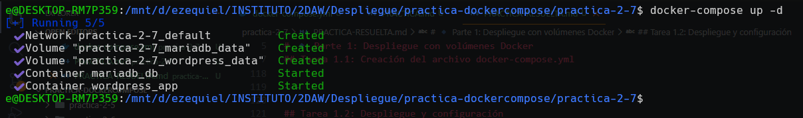

---

2. Observa qué recursos se crean automáticamente.

Al ejecutar `docker-compose up -d`, Docker Compose crea automáticamente los siguientes recursos:

1. **Red**: Se crea una red bridge por defecto llamada `wordpress_compose_default` que conecta ambos contenedores
2. **Volúmenes**: Se crean los dos volúmenes definidos:
   - `wordpress_compose_wordpress_data`
   - `wordpress_compose_mariadb_data`
3. **Contenedores**: Se crean y arrancan dos contenedores:
   - `wordpress_app` (basado en la imagen wordpress:latest)
   - `mariadb_db` (basado en la imagen mariadb:latest)

Docker Compose automáticamente añade un prefijo al nombre de los recursos usando el nombre del directorio del proyecto (`wordpress_compose_`).

---

3. Verifica el estado de los servicios.

**Comandos ejecutados:**

```bash
# Ver el estado de los contenedores
docker-compose ps

# Ver las redes creadas
docker network ls

# Ver los volúmenes creados
docker volume ls

# Ver los logs de WordPress
docker-compose logs wordpress

# Ver los logs de MariaDB
docker-compose logs mariadb
```

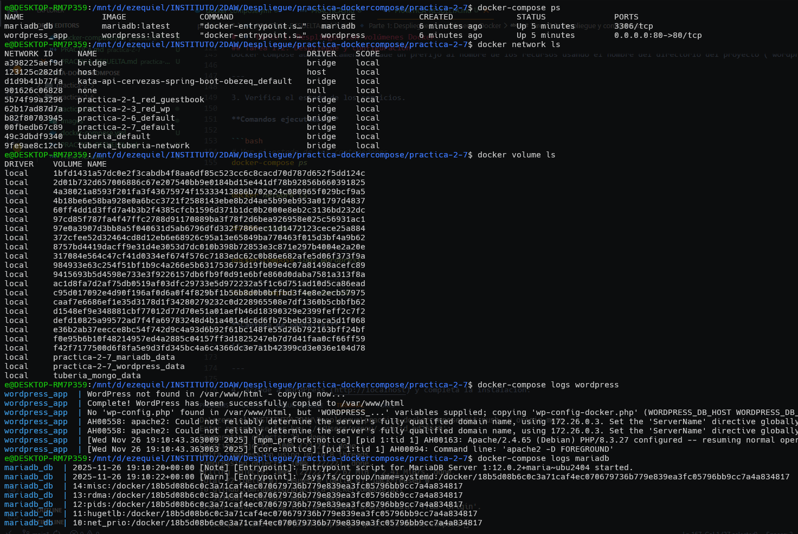

---

4. Accede a WordPress (http://localhost) y completa la instalación:
   - Título del sitio
   - Usuario administrador
   - Contraseña
   - Email

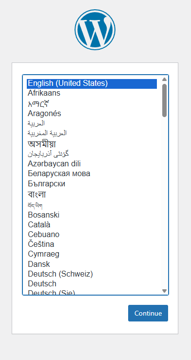

---

site title: el templo
username: solomon
password: EduPonmeUn10!
email: solomon@33.com

5. Crea contenido:
   - Al menos 3 páginas
   - Al menos 5 posts/entradas
   - Instala y activa un tema
   - Instala al menos 2 plugins

Paginas Wordpress
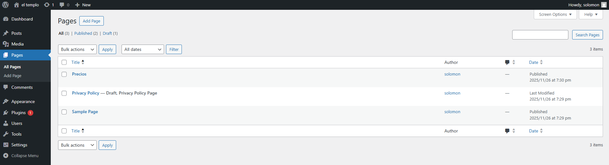

Posts Wordpress
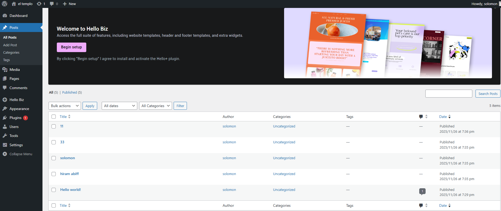

Tema instalado
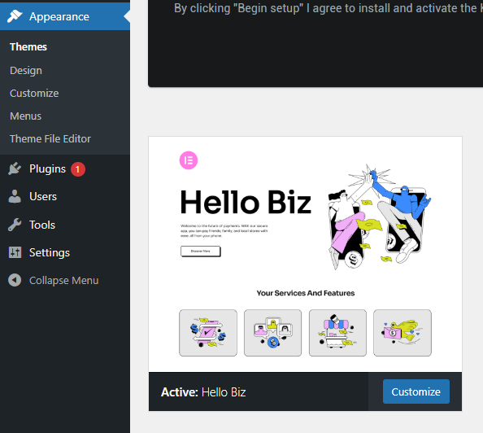

Plugins instalado
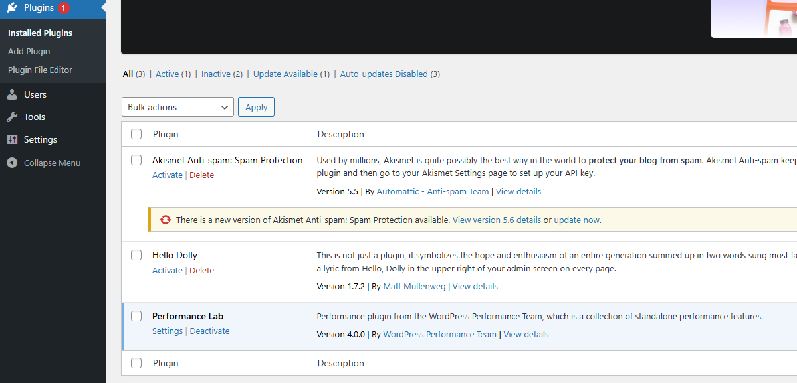

---

## Tarea 1.3: Gestión del escenario

1. **Detener servicios:**
   - Detén ambos servicios
   - Verifica que están detenidos pero no eliminados

```bash
docker-compose stop

docker-compose ps
```


2. **Reiniciar y verificar persistencia:**
   - Arranca los servicios nuevamente
   - Accede a WordPress
   - Verifica que todo el contenido persiste

```bash
docker-compose start

docker-compose ps
```

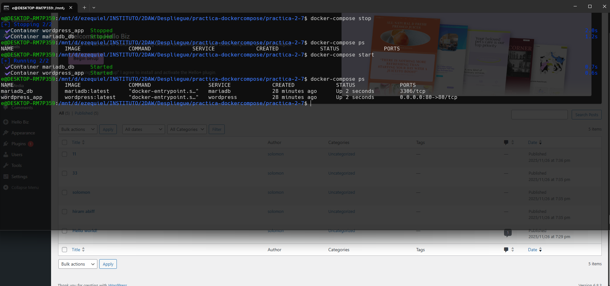

---

3. **Eliminar contenedores (sin volúmenes):**
   - Elimina el escenario manteniendo los volúmenes
   - Verifica que los volúmenes siguen existiendo
   - Recrea el escenario
   - Comprueba que los datos persisten

**Comandos ejecutados:**

```bash
docker-compose down

docker volume ls | grep wordpress

docker-compose up -d

docker-compose ps
```

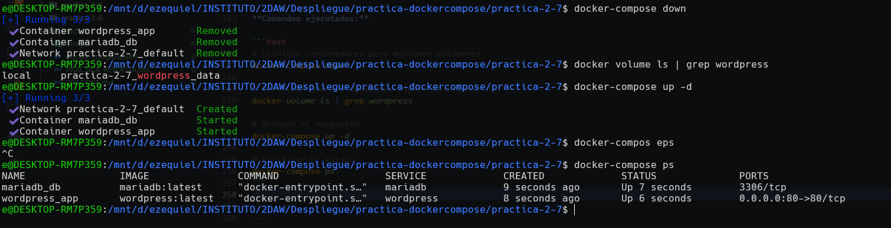

---

4. **Eliminar todo (con volúmenes):**
   - Elimina el escenario incluyendo volúmenes
   - Verifica que los volúmenes se han eliminado
   - Recrea el escenario
   - Comprueba que WordPress pide instalación inicial

```bash
docker-compose down -v

docker volume ls | grep wordpress

docker-compose up -d
```


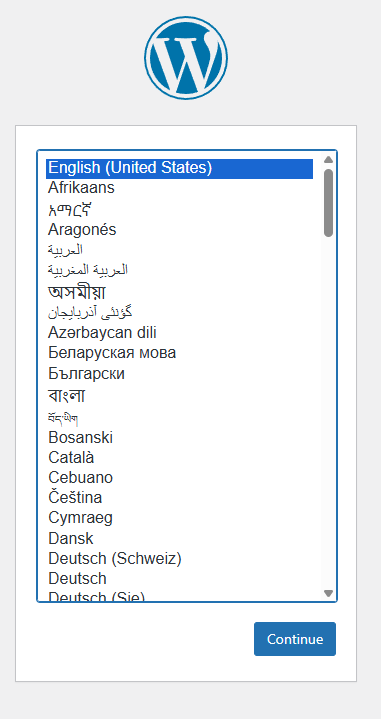

---

# 🔹 Parte 2: Despliegue con bind mounts

## Tarea 2.1: Archivo docker-compose.yml con bind mount

1. Crea un nuevo directorio: `~/wordpress_bind`.

2. Crea los directorios necesarios para los bind mounts:
   - Directorio para datos de WordPress
   - Directorio para datos de MySQL/MariaDB

```bash
mkdir -p ~/wordpress_bind

cd ~/wordpress_bind

mkdir -p wordpress_data
mkdir -p mysql_data
```

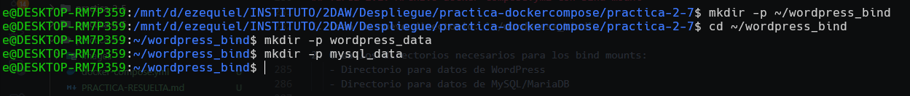

---

3. Crea un nuevo archivo `docker-compose.yml` que use **bind mounts** en lugar de volúmenes Docker:
   - Investiga la sintaxis para bind mounts en Docker Compose
   - Usa rutas relativas (`./directorio`) para montar desde el host
   - Mantén la misma estructura de servicios que en la Parte 1
   - Cambia solo la definición de volúmenes por bind mounts

**Archivo docker-compose.yml:**

```yaml
version: '3.8'

services:
  wordpress:
    image: wordpress:latest
    container_name: wordpress_bind
    restart: always
    ports:
      - "80:80"
    environment:
      WORDPRESS_DB_HOST: mariadb
      WORDPRESS_DB_USER: wordpress_user
      WORDPRESS_DB_PASSWORD: wordpress_pass
      WORDPRESS_DB_NAME: wordpress_db
    volumes:
      - ./wordpress_data:/var/www/html/wp-content
    depends_on:
      - mariadb

  mariadb:
    image: mariadb:latest
    container_name: mariadb_bind
    restart: always
    environment:
      MYSQL_ROOT_PASSWORD: root_password
      MYSQL_DATABASE: wordpress_db
      MYSQL_USER: wordpress_user
      MYSQL_PASSWORD: wordpress_pass
    volumes:
      - ./mysql_data:/var/lib/mysql
```

---

4. Despliega la aplicación y configura WordPress nuevamente.

```bash
docker-compose up -d

docker-compose ps
```

---

## Tarea 2.2: Comparación de enfoques

1. Explora los directorios `wordpress` y `mysql` en el host.


---

2. Identifica qué archivos hay en cada directorio.

**Respuesta:**

**Directorio wordpress_data:**

Como hemos hecho un down -v pues no hay nada de momento, pero si no hubieramos borrado el volumen anteriormente, estaria esta informacion en la siguiente estructura de carpetas de WordPress:
- `plugins/`: carpeta con los plugins instalados
- `themes/`: carpeta con los temas instalados
- `uploads/`: carpeta con las imágenes y archivos multimedia subidos
- `upgrade/`: carpeta temporal para actualizaciones
- Posibles archivos de cache y configuración adicional

**Directorio mysql_data:**
Contiene los archivos internos de MariaDB:
- `mysql/`: base de datos del sistema
- `wordpress_db/`: nuestra base de datos de WordPress con archivos `.ibd` y `.frm`
- `performance_schema/`: base de datos de métricas de rendimiento
- `ib_logfile0`, `ib_logfile1`: archivos de log de transacciones
- `ibdata1`: archivo de datos del tablespace
- Archivos de configuración y estado de MariaDB

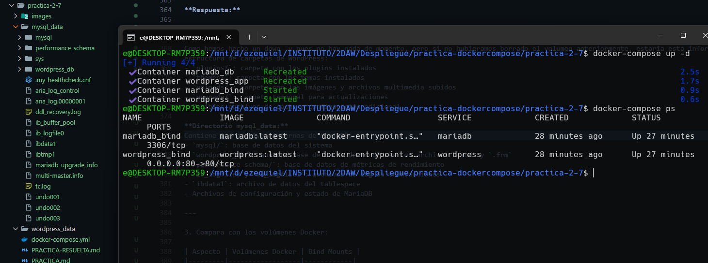

---

3. Compara con los volúmenes Docker:

Los volúmenes de Docker se guardan en /var/lib/docker/volumes/, es decir, en una zona que gestiona Docker y que no suele ser tan fácil de explorar desde el host. En cambio, los bind mounts apuntan a una carpeta del propio sistema, como ~/wordpress_bind/, que yo elijo y a la que puedo entrar sin problema.

En cuanto a la visibilidad, los volúmenes no se ven directamente desde el host y normalmente hay que usar comandos de Docker para inspeccionarlos, mientras que los bind mounts se ven igual que cualquier carpeta normal.

Los volúmenes son mucho más portables porque no dependen de la estructura del sistema donde se mueven. Los bind mounts, en cambio, dependen de que exista la misma ruta en el nuevo host, así que su portabilidad es más limitada.

Para hacer copias de seguridad, los volúmenes requieren usar comandos de Docker o contenedores temporales, mientras que con los bind mounts basta con usar las herramientas del sistema, como cp, tar o rsync.

Por último, los permisos en los volúmenes los gestiona Docker de forma automática, mientras que en los bind mounts sí pueden aparecer problemas de permisos entre el contenedor y el sistema host.

---

# 🔹 Parte 3: Configuración avanzada

## Tarea 3.1: Variables de entorno desde archivo

1. Investiga cómo usar archivos `.env` con Docker Compose.

Docker Compose permite usar archivos `.env` para definir variables de entorno que luego se pueden referenciar en el `docker-compose.yml`.

Funcionamiento:
- Se crea un archivo llamado `.env` en el mismo directorio que el `docker-compose.yml`
- Las variables se definen en formato `NOMBRE_VARIABLE=valor`
- En el docker-compose.yml se referencian usando la sintaxis `${NOMBRE_VARIABLE}`
- Docker Compose automáticamente carga el archivo `.env` al ejecutarse

Ventajas:
- Separar configuración sensible (contraseñas) del código
- Poder tener diferentes `.env` para desarrollo, testing y producción
- Facilitar el uso de `.gitignore` para no subir credenciales al repositorio

---

2. Crea un archivo `.env` que contenga todas las variables de configuración:
   - Contraseña root de MySQL
   - Nombre de la base de datos
   - Usuario de la base de datos
   - Contraseña del usuario
   - Variables correspondientes para WordPress
   - Puerto de WordPress

**Archivo .env:**

```
# MySQL Configuration
MYSQL_ROOT_PASSWORD=super_secret_root_pass
MYSQL_DATABASE=wordpress_db
MYSQL_USER=wordpress_user
MYSQL_PASSWORD=wordpress_secret_pass

# WordPress Configuration
WORDPRESS_DB_HOST=mariadb
WORDPRESS_DB_USER=wordpress_user
WORDPRESS_DB_PASSWORD=wordpress_secret_pass
WORDPRESS_DB_NAME=wordpress_db

# Port Configuration
WORDPRESS_PORT=80
```

---

3. Modifica tu `docker-compose.yml` para usar variables del archivo `.env` con la sintaxis `${VARIABLE}`.


```yaml
version: '3.8'

services:
  wordpress:
    image: wordpress:latest
    container_name: wordpress_env
    restart: always
    ports:
      - "${WORDPRESS_PORT}:80"
    environment:
      WORDPRESS_DB_HOST: ${WORDPRESS_DB_HOST}
      WORDPRESS_DB_USER: ${WORDPRESS_DB_USER}
      WORDPRESS_DB_PASSWORD: ${WORDPRESS_DB_PASSWORD}
      WORDPRESS_DB_NAME: ${WORDPRESS_DB_NAME}
    volumes:
      - wordpress_data:/var/www/html/wp-content
    depends_on:
      - mariadb

  mariadb:
    image: mariadb:latest
    container_name: mariadb_env
    restart: always
    environment:
      MYSQL_ROOT_PASSWORD: ${MYSQL_ROOT_PASSWORD}
      MYSQL_DATABASE: ${MYSQL_DATABASE}
      MYSQL_USER: ${MYSQL_USER}
      MYSQL_PASSWORD: ${MYSQL_PASSWORD}
    volumes:
      - mariadb_data:/var/lib/mysql

volumes:
  wordpress_data:
  mariadb_data:
```

---

4. Despliega y verifica que funciona correctamente.

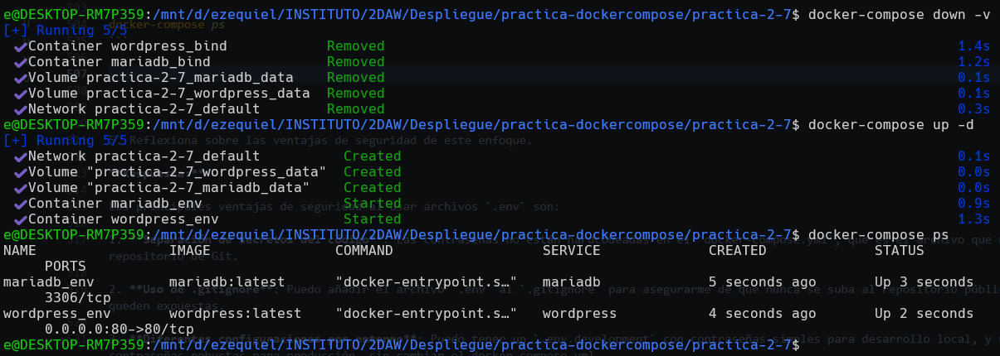

---

5. Reflexiona sobre las ventajas de seguridad de este enfoque.

Usar archivos .env tiene varias ventajas de seguridad. La más clara es que las contraseñas y otros datos sensibles no van metidos directamente en el docker-compose.yml, que normalmente sí se sube a Git. Además, como el .env se puede añadir al .gitignore, evitamos que esas credenciales acaben en un repositorio público.

También permite tener distintos archivos según el entorno: uno más simple para desarrollo y otro más seguro para producción, sin tener que tocar el compose. Otra ventaja es que el .env puede tener permisos más restrictivos en el servidor, así que solo ciertas personas pueden leerlo. Y si hay que cambiar una contraseña, basta con editar ese archivo sin modificar la configuración del servicio.

Aun así, sigue siendo un archivo de texto plano, así que para entornos más serios habría que pensar en algo más seguro, como Docker Secrets o gestores externos de secretos.

---

## Tarea 3.2: Configuración de red personalizada

1. Investiga en la documentación cómo definir redes personalizadas en Docker Compose.

Docker Compose permite crear redes personalizadas para controlar mejor cómo se comunican los contenedores. En el archivo docker-compose.yml se añade una sección networks: (al mismo nivel que services:) y luego cada servicio se puede conectar a una o varias de esas redes.

Los tipos de red más comunes son:
- bridge, que es la red interna típica donde los contenedores pueden hablar entre ellos;
- host, que usa directamente la red del host;
- overlay, pensada para Swarm y varios hosts;
- macvlan, que da a los contenedores direcciones MAC propias.

---

2. Modifica tu archivo `docker-compose.yml` para incluir:
   - Definición de una red personalizada tipo bridge
   - Conecta ambos servicios a esta red
   - Usa un nombre descriptivo para la red

```yaml
version: '3.8'

services:
  wordpress:
    image: wordpress:latest
    container_name: wordpress_net
    restart: always
    ports:
      - "${WORDPRESS_PORT}:80"
    environment:
      WORDPRESS_DB_HOST: ${WORDPRESS_DB_HOST}
      WORDPRESS_DB_USER: ${WORDPRESS_DB_USER}
      WORDPRESS_DB_PASSWORD: ${WORDPRESS_DB_PASSWORD}
      WORDPRESS_DB_NAME: ${WORDPRESS_DB_NAME}
    volumes:
      - wordpress_data:/var/www/html/wp-content
    depends_on:
      - mariadb
    networks:
      - wordpress_network

  mariadb:
    image: mariadb:latest
    container_name: mariadb_net
    restart: always
    environment:
      MYSQL_ROOT_PASSWORD: ${MYSQL_ROOT_PASSWORD}
      MYSQL_DATABASE: ${MYSQL_DATABASE}
      MYSQL_USER: ${MYSQL_USER}
      MYSQL_PASSWORD: ${MYSQL_PASSWORD}
    volumes:
      - mariadb_data:/var/lib/mysql
    networks:
      - wordpress_network

volumes:
  wordpress_data:
  mariadb_data:

networks:
  wordpress_network:
    driver: bridge
```

---

3. Verifica la configuración de red usando comandos de Docker Compose e inspección de red.

```bash
docker-compose up -d

docker network ls

docker network inspect wordpress_compose_wordpress_network

docker-compose ps
```

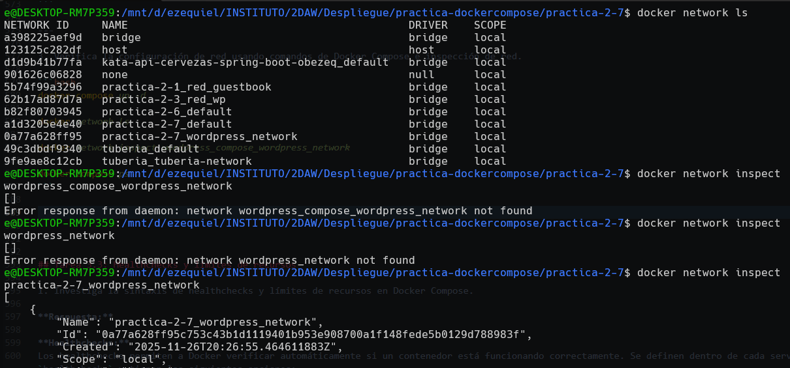

---

## Tarea 3.3: Healthchecks y límites de recursos

1. Investiga la sintaxis de healthchecks y límites de recursos en Docker Compose.

Healthchecks:
Los healthchecks sirven para que Docker compruebe automáticamente si un contenedor está funcionando bien. Se añaden dentro de cada servicio con healthcheck: y suelen incluir:

- test, que es el comando que se ejecuta para ver si todo va bien (si devuelve 0, el contenedor está sano);
- interval, cada cuánto se hace la comprobación;
- timeout, el tiempo máximo que puede tardar la respuesta;
- retries, cuántas veces puede fallar antes de marcarlo como unhealthy;
- start_period, un tiempo inicial de espera antes de empezar a contar fallos.

Límites de recursos:
También se pueden poner límites de CPU y memoria para que un contenedor no se quede con todos los recursos. Esto se hace en deploy: → resources: y normalmente se indica:

- cpus, que puede ser un número decimal (por ejemplo, 0.5 para media CPU);
- memory, para fijar la memoria máxima (512M, 1G, etc.).

Poner estos límites ayuda a evitar que un servicio sature el sistema, garantiza recursos mínimos para los servicios más importantes y en general hace que todo funcione de manera más estable.

---

2. Añade a tu archivo `docker-compose.yml`:

   **Para WordPress:**
   - Healthcheck que verifique la disponibilidad del puerto 80
   - Límites: 1 CPU y 512MB de memoria
   - cpus: 1 para WordPress
   - memoria: 512M para ambos
   - test: curl -f http://localhost para WordPress
   - interval: 30s
   - timeout: 10s
   - retries: 3

   **Para MariaDB:**
   - Healthcheck que verifique la disponibilidad de MySQL
   - Límites: 0.5 CPU y 512MB de memoria
   - cpus: 0.5 para MariaDB
   - memoria: 512M para ambos
   - test: mysqladmin ping -h localhost para MariaDB
   - interval: 30s
   - timeout: 3s
   - retries: 3


```yaml
version: '3.8'

services:
  wordpress:
    image: wordpress:latest
    container_name: wordpress_full
    restart: always
    ports:
      - "${WORDPRESS_PORT}:80"
    environment:
      WORDPRESS_DB_HOST: ${WORDPRESS_DB_HOST}
      WORDPRESS_DB_USER: ${WORDPRESS_DB_USER}
      WORDPRESS_DB_PASSWORD: ${WORDPRESS_DB_PASSWORD}
      WORDPRESS_DB_NAME: ${WORDPRESS_DB_NAME}
    volumes:
      - wordpress_data:/var/www/html/wp-content
    depends_on:
      - mariadb
    networks:
      - wordpress_network
    healthcheck:
      test: ["CMD", "curl", "-f", "http://localhost"]
      interval: 30s
      timeout: 10s
      retries: 3
    deploy:
      resources:
        limits:
          cpus: '1'
          memory: 512M

  mariadb:
    image: mariadb:latest
    container_name: mariadb_full
    restart: always
    environment:
      MYSQL_ROOT_PASSWORD: ${MYSQL_ROOT_PASSWORD}
      MYSQL_DATABASE: ${MYSQL_DATABASE}
      MYSQL_USER: ${MYSQL_USER}
      MYSQL_PASSWORD: ${MYSQL_PASSWORD}
    volumes:
      - mariadb_data:/var/lib/mysql
    networks:
      - wordpress_network
    healthcheck:
      test: ["CMD", "mysqladmin", "ping", "-h", "localhost"]
      interval: 30s
      timeout: 3s
      retries: 3
    deploy:
      resources:
        limits:
          cpus: '0.5'
          memory: 512M

volumes:
  wordpress_data:
  mariadb_data:

networks:
  wordpress_network:
    driver: bridge
```

---

3. Investiga qué comando usar para verificar el estado de salud de los servicios.

Para ver el estado de salud de los servicios hay varios comandos útiles. El más directo es docker-compose ps, que enseña si cada contenedor está healthy o unhealthy. Si quiero más detalle, puedo usar docker inspect <el_nombre_del_contanedor>, donde aparece toda la información del healthcheck. Incluso se puede filtrar con grep para ver solo la parte de “Health”. También docker ps muestra el estado en la columna STATUS.

Los estados que pueden aparecer son:

- starting, cuando todavía está en el periodo inicial antes de empezar a comprobarlo;
- healthy, si el último healthcheck salió bien;
- unhealthy, si ha fallado varias veces seguidas según lo configurado.

```bash
docker-compose ps

docker inspect wordpress_full | grep -A 10 Health

docker inspect mariadb_full | grep -A 10 Health

docker ps
```

---

4. Verifica que los healthchecks funcionan correctamente.

[healthchecks](images/parte3-tarea-3-3-healthcehcks.png)

---

# 🔹 Parte 4: Backup y restauración

## Tarea 4.1: Backup con volúmenes Docker

1. Investiga estrategias para realizar backups de volúmenes Docker.

Para hacer backup de volúmenes Docker gestionados, la estrategia más común es:

1. **Usar un contenedor temporal** que monte:
   - El volumen a respaldar (modo solo lectura)
   - Un directorio del host donde guardar el backup

2. **Comprimir los datos** usando herramientas como `tar` dentro del contenedor temporal

3. **Guardar el archivo comprimido** en el host para tenerlo disponible

Comandos típicos:
```bash
docker run --rm -v <volumen>:/source:ro -v <directorio_host>:/backup alpine tar czf /backup/archivo.tar.gz -C /source .
```

Donde:
- `--rm`: Elimina el contenedor al terminar
- `-v <volumen>:/source:ro`: Monta el volumen en modo solo lectura
- `-v <directorio_host>:/backup`: Monta directorio del host para guardar backup
- `alpine`: Imagen ligera con las herramientas necesarias
- `tar czf`: Crea un archivo tar comprimido con gzip

Esta estrategia funciona porque el contenedor temporal tiene acceso tanto al volumen Docker como al sistema de archivos del host.

2. Crea un directorio para backups.

```bash
mkdir -p ~/backups_wordpress

ls -la ~/backups_wordpress
```

3. Investiga y ejecuta comandos para:
   - Crear un backup del volumen de WordPress usando un contenedor temporal
   - Crear un backup del volumen de MariaDB usando un contenedor temporal
   - Comprimir los datos en archivos tar.gz
   - Almacenar los backups en el directorio del host

**Pista:** Necesitarás usar contenedores temporales que monten el volumen y un directorio de backup.

**Comandos ejecutados:**

```bash
# Backup del volumen de WordPress
docker run --rm \
  -v wordpress_compose_wordpress_data:/source:ro \
  -v ~/backups_wordpress:/backup \
  alpine \
  tar czf /backup/wordpress_backup.tar.gz -C /source .

# Backup del volumen de MariaDB
docker run --rm \
  -v wordpress_compose_mariadb_data:/source:ro \
  -v ~/backups_wordpress:/backup \
  alpine \
  tar czf /backup/mariadb_backup.tar.gz -C /source .

# Verificar que se crearon los backups
ls -lh ~/backups_wordpress
```

---

4. Verifica que los archivos de backup se han creado correctamente.

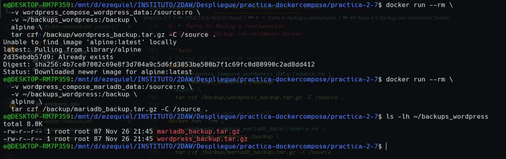

---

## Tarea 4.2: Restauración desde backup

1. Elimina el escenario completo incluyendo los volúmenes.

```bash
docker-compose down -v

docker volume ls | grep wordpress
```

2. Vuelve a crear el escenario (se crearán volúmenes vacíos).

```bash
# Crear los servicios sin iniciarlos (crea volúmenes vacíos)
docker-compose up --no-start
```

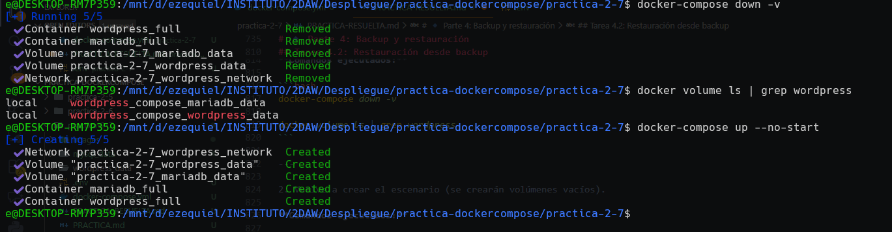

---

3. Investiga y ejecuta comandos para restaurar los datos desde los backups:
   - Usa contenedores temporales para descomprimir y restaurar datos
   - Restaura el volumen de WordPress
   - Restaura el volumen de MariaDB

```bash
# Restaurar el volumen de WordPress
docker run --rm \
  -v wordpress_compose_wordpress_data:/target \
  -v ~/backups_wordpress:/backup \
  alpine \
  tar xzf /backup/wordpress_backup.tar.gz -C /target

# Restaurar el volumen de MariaDB
docker run --rm \
  -v wordpress_compose_mariadb_data:/target \
  -v ~/backups_wordpress:/backup \
  alpine \
  tar xzf /backup/mariadb_backup.tar.gz -C /target
```

---

4. Arranca el escenario con Docker Compose.

**Comandos ejecutados:**

```bash
# Iniciar los servicios
docker-compose up -d

# Verificar que están corriendo
docker-compose ps
```

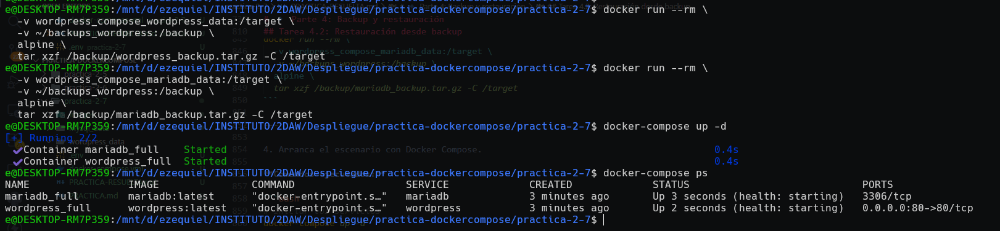

---

**Reflexión:** ¿Por qué es importante probar regularmente los procesos de restauración?

Es importante probar los procesos de restauración porque un backup que nunca se prueba puede fallar justo cuando más lo necesitamos. A veces parece que todo se está guardando bien, pero luego resulta que los archivos estaban corruptos o incompletos y no te enteras hasta el momento crítico.

También ayuda a conocer el proceso. En una situación de emergencia es fácil ponerse nervioso, pero si ya has restaurado varias veces sabes qué hacer, qué comandos usar y cuánto tarda todo.

Otra razón es que los sistemas cambian con el tiempo: versiones nuevas, cambios en volúmenes, configuraciones distintas… Si no se prueba la restauración, estos cambios pueden romper el proceso sin que lo sepamos.

Además, restaurar sirve para comprobar que los datos realmente están bien y que la aplicación funciona después de cargarlos.

Y en entornos más profesionales, probar la restauración es parte de los planes de recuperación ante desastres, donde hay que asegurarse de que los tiempos de recuperación se pueden cumplir.

---

## Tarea 4.3: Backup con bind mounts

1. Para el escenario con bind mounts, el backup es más directo.

2. Investiga qué comandos del sistema operativo puedes usar para:
   - Crear copias de seguridad de directorios completos
   - Comprimir los directorios en archivos tar.gz
   - Verificar la integridad de los backups

Con bind mounts hacer backups es mucho más fácil porque los archivos están directamente en el sistema del host, así que puedo usar comandos normales del SO sin depender de Docker.

Para crear copias comprimidas puedo usar tar, por ejemplo tar czf archivo.tar.gz directorio/ para hacer un tar.gz o zip -r archivo.zip directorio/ si prefiero zip.

Si simplemente quiero copiar un directorio, puedo usar cp -r o rsync -av, que va muy bien para backups más completos o incrementales.

Para comprobar que el backup está bien, puedo listar el contenido del tar con tar tzf archivo.tar.gz o generar un checksum con md5sum archivo.tar.gz > archivo.md5 y luego verificarlo con md5sum -c archivo.md5.

La ventaja general es que no hace falta ningún comando especial de Docker, solo herramientas normales del sistema operativo.

4. Compara las ventajas y desventajas del backup con bind mounts vs. volúmenes Docker:
   - Facilidad de ejecución
   - Necesidad de comandos Docker
   - Visibilidad de los datos
   - Portabilidad

Hacer backups con volúmenes Docker suele ser más complicado porque normalmente hace falta usar contenedores temporales y comandos de Docker para acceder a los datos. En cambio, con bind mounts todo es bastante más sencillo: basta con usar cp, tar, rsync, etc., sin tener que tocar Docker.

Otra diferencia importante es la visibilidad. Los volúmenes se guardan dentro de /var/lib/docker/volumes/, así que no es tan fácil verlos directamente desde el host. Los bind mounts, en cambio, están en una carpeta normal del sistema, así que puedo entrar, editar y revisar los archivos sin problemas.

En cuanto a portabilidad, los volúmenes suelen ser más consistentes porque funcionan igual en cualquier host con Docker. Los bind mounts dependen de que la ruta exista en el sistema y también de las herramientas disponibles (tar, zip, etc.), por lo que son un poco menos portables.

---


# 🔹 Parte 5: Análisis y documentación

## Tarea 5.1: Preguntas de análisis

### 1. Volúmenes vs. bind mounts

**¿Cuándo usaría volúmenes Docker?**
Los usaría sobre todo en producción, cuando quiero algo más estable y seguro. Los volúmenes rinden mejor (especialmente en Windows/macOS), no dependen de rutas del host y son más portables si tengo que mover la aplicación a otro servidor. También me vienen bien cuando tengo varios contenedores que necesitan compartir datos o cuando quiero aislar los datos del sistema del host.

**¿Cuándo usaría bind mounts?**
En desarrollo, porque puedo abrir los archivos directamente desde mi editor, ver los logs de forma sencilla y modificar configuraciones sin meterme en comandos Docker. También ayudan cuando estoy aprendiendo o cuando quiero tener los datos a mano para revisarlos o depurarlos.

**¿Cuál es más fácil para backups?**
Los bind mounts, porque puedo copiar la carpeta con `cp`, `tar`, `rsync`… sin necesidad de crear contenedores temporales. Con volúmenes también se puede, pero es un poco más “técnico”.

### 2. Seguridad

**¿Es seguro guardar contraseñas en el Compose?**
La verdad es que no. Si subo el archivo a un repo público, todo queda expuesto. Además, cualquier persona con acceso al proyecto podría ver las credenciales. Y no es práctico si quiero tener distintas contraseñas para desarrollo y producción.

**¿Cómo mejora la seguridad usar `.env`?**
Gran parte de la mejora viene de lo siguiente:

* Se puede añadir al `.gitignore` para que nunca se suba al repo.
* Le puedo poner permisos restrictivos para que solo el propietario pueda leerlo.
* Puedo tener distintos `.env` según el entorno.
* Y puedo dejar un `.env.example` sin credenciales reales para documentar qué variables hacen falta.

**¿Qué otras medidas tomaría?**
Además del `.env`, usaría cosas como Docker Secrets o incluso gestores externos (Vault, AWS Secrets Manager…). También usaría contraseñas fuertes, rotación periódica, no usaría el usuario root de MariaDB para WordPress, cifraría los volúmenes si es posible, limitaría puertos expuestos y aislaría los servicios con varias redes Docker.

### 3. Persistencia

**Si pierdo el volumen de WordPress:**
Se pierden temas, plugins, personalizaciones y archivos multimedia. Lo que sí se mantiene es casi todo el contenido del sitio porque está en la base de datos. No es un desastre absoluto, pero sí molesto.

**Si pierdo el volumen de MariaDB:**
Aquí sí que es un desastre total. Se pierde todo: posts, páginas, comentarios, usuarios, opciones del sitio, configuraciones… todo. Es como reinstalar WordPress desde cero. Sin un backup no hay forma de recuperarlo.

**¿Cuál es más crítico?**
El de MariaDB, sin ninguna duda. Es literalmente donde está toda la información importante del sitio.

### 4. Dependencias

**¿Por qué WordPress depende de MariaDB?**
Porque WordPress lo guarda absolutamente todo en la base de datos: contenido, usuarios, configuraciones, opciones del sitio, etc. Sin la base de datos, WordPress no puede ni arrancar correctamente.

**¿Qué pasa si WordPress arranca sin MariaDB?**
El contenedor se inicia, pero en el navegador aparece el mensaje típico de “Error establishing a database connection”. Básicamente no puede funcionar.

**¿`depends_on` garantiza que MariaDB ya esté lista?**
No, solo asegura que MariaDB arranca antes, pero no que ya esté preparada. A veces tarda unos segundos en inicializarse y WordPress puede fallar. Para hacerlo bien habría que usar un `healthcheck` en MariaDB y un `depends_on` con `condition: service_healthy`.

### 5. Comparación con la práctica anterior

**¿Cuántos comandos usaba antes?**
Un montón: crear red, crear volúmenes, arrancar contenedores con comandos largos, parar, borrar, comprobar estado… En total entre 13 y 16 comandos.

**¿Cuántos uso con Compose?**
Normalmente entre 1 y 5: `up`, `ps`, `logs`, `stop` y `down -v`. Todos más cortos y fáciles de recordar.

**¿Qué es más fácil de mantener?**
Compose, sin duda. Todo está en un archivo que puedo versionar, leer, entender y modificar sin tener que recordar órdenes interminables. Además, es más difícil equivocarse.

## Tarea 5.2: Escenarios de uso

### 1. Desarrollo local

En desarrollo usaría bind mounts. Es mucho más cómodo ver y modificar los archivos desde el editor, acceder a logs, experimentar y hacer pequeños backups antes de probar cosas. Además, los cambios se ven al instante.

### 2. Producción

En producción usaría volúmenes Docker. Rinden mejor, son más seguros, no dependen de rutas concretas y son más estables a largo plazo. Aquí lo importante no es editar archivos rápidamente, sino que todo sea fiable y permanente. Además, son más fáciles de automatizar en backups.

### 3. Testing / CI

En CI usaría volúmenes Docker. Los contenedores se crean y destruyen todo el rato, y los volúmenes son más rápidos y limpios. Además, evito depender de las rutas del runner de CI y puedo paralelizar tareas sin problemas. Bind mounts solo los usaría si quiero inyectar código de pruebas o sacar informes del contenedor.

