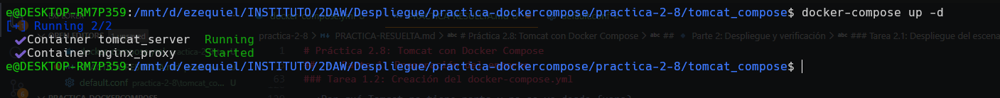
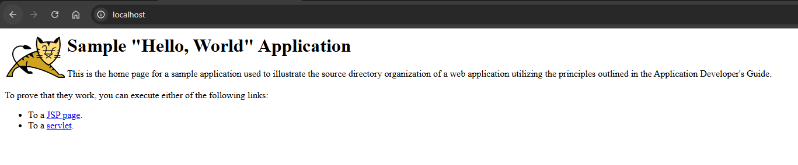

# Práctica 2.8: Tomcat con Docker Compose

## 🔹 Parte 1: Preparación del entorno

### Tarea 1.1: Estructura de archivos

1. Crea el directorio del proyecto: `~/tomcat_compose`.

2. Investiga qué archivos necesitas para este despliegue:
   - Un archivo WAR de una aplicación Java (puedes descargarlo del repositorio del curso o usar uno propio)
   - Un archivo de configuración de Nginx para el proxy inverso

3. Dentro del directorio, crea la siguiente estructura:

```
tomcat_compose/
├── docker-compose.yml
├── default.conf
└── sample.war
```

**Comandos ejecutados:**
```bash
cd practica-2-8
mkdir -p tomcat_compose
cd tomcat_compose
```

---

4. Descarga o crea los archivos necesarios:
   - `sample.war` - Aplicación Java de ejemplo
   - Puedes descargar desde el repositorio del curso o usar cualquier WAR simple

```bash
curl -L -o sample.war "https://tomcat.apache.org/tomcat-7.0-doc/appdev/sample/sample.war"
```

---

5. Crea el archivo `default.conf` con la configuración de Nginx:

```nginx
server {
    listen       80;
    listen  [::]:80;
    server_name  localhost;

    location / {
        root   /usr/share/nginx/html;
        proxy_pass http://aplicacionjava:8080/sample/;
    }

    error_page   500 502 503 504  /50x.html;
    location = /50x.html {
        root   /usr/share/nginx/html;
    }
}
```

---

### Tarea 1.2: Creación del docker-compose.yml

1. Investiga la documentación de Docker Compose sobre bind mounts.

Los bind mounts básicamente te dejan montar carpetas o archivos del ordenador directamente en el contenedor. La diferencia con los volúmenes normales es que con bind mounts trabajas con archivos que tú tienes en tu máquina, entonces si cambias algo en el archivo desde fuera se ve reflejado dentro del contenedor al instante. Se ponen en la parte de volumes del compose con algo como ./archivo:/ruta/contenedor y si le añades :ro al final lo montas en solo lectura para que el contenedor no pueda tocarlo.

---

2. Crea un archivo `docker-compose.yml` que defina:

   **Servicio de Tomcat:**
   - Imagen: `tomcat:9.0`
   - Bind mount del archivo WAR al directorio de despliegue de Tomcat (`/usr/local/tomcat/webapps/`)
   - Montaje en modo solo lectura (`:ro`)
   - NO mapear puertos al host (acceso solo interno)
   - Política de reinicio

   **Servicio de Nginx (proxy):**
   - Imagen: `nginx`
   - Puerto 80 del host mapeado al puerto 80 del contenedor
   - Bind mount del archivo de configuración a la ubicación correcta en Nginx
   - Montaje en modo solo lectura (`:ro`)
   - Dependencia del servicio de Tomcat
   - Política de reinicio

`docker-compose.yml`

```yaml
version: '3.8'

services:
  aplicacionjava:
    image: tomcat:9.0
    container_name: tomcat_server
    volumes:
      - ./sample.war:/usr/local/tomcat/webapps/sample.war:ro
    restart: always

  proxy:
    image: nginx
    container_name: nginx_proxy
    ports:
      - "80:80"
    volumes:
      - ./default.conf:/etc/nginx/conf.d/default.conf:ro
    depends_on:
      - aplicacionjava
    restart: always
```

---

3. Analiza y responde:

- ¿Por qué usamos bind mounts y no volúmenes normales de Docker?

Pues básicamente porque queremos tocar los archivos de configuración desde la máquina host sin complicarnos la vida. Con el bind mount editamos el default.conf o cambiamos el .war directamente en la carpeta del host y ya está, sin entrar al contenedor ni tener que rebuild la imagen cada vez. Los volúmenes de Docker son más para datos que tienen que sobrevivir aunque borres el contenedor, pero aquí los archivos son nuestros y los queremos controlar nosotros mismos, así que bind mount es mucho más práctico cuando vas a estar modificando cosas seguido.

- ¿Qué es lo del :ro y para qué lo ponemos?

:ro es "read-only", o sea solo lectura. Lo ponemos para que el contenedor no pueda tocar ni modificar los archivos que le montamos desde el host. Es seguridad pura: si alguien entra al contenedor (por lo que sea), no puede cargarse nuestra config original ni meter nada raro. Además evita accidentes tontos de que el contenedor sobreescriba algo sin querer. Como ni Nginx ni Tomcat necesitan escribir en esos archivos (solo leer el conf y el .war), montarlos en read-only es lo suyo.

- ¿Por qué Nginx tiene depends_on del Tomcat?

Porque Nginx hace de proxy inverso y en su config tiene proxy_pass http://aplicacionjava:8080; o sea, necesita que el nombre "aplicacionjava" ya exista en la red cuando arranque. Si Nginx arranca antes, no resuelve el nombre y se cae. Con depends_on le decimos a Docker Compose "arranca primero Tomcat y cuando esté levantado, entonces arranca Nginx". Así todo funciona en orden.

- ¿Por qué Tomcat no tiene ports y no se ve desde fuera?

Porque no hace falta que esté expuesto directamente al host. Solo lo usa Nginx desde dentro de la red de Docker. Es mucho más seguro: el único que mira al mundo exterior es Nginx por el puerto 80, y todo el tráfico al backend va por la red interna. Así nadie puede saltarse Nginx y atacar directo a Tomcat. Es la forma típica de montar una arquitectura con proxy + aplicación.

---

## 🔹 Parte 2: Despliegue y verificación

### Tarea 2.1: Despliegue del escenario

1. Desde el directorio del proyecto, despliega con Docker Compose.

```bash
docker-compose up -d
```



---

2. Observa la salida y verifica qué recursos se crean.

Al hacer docker-compose up -d se crean varias cosas:
- Una red bridge automática (tomcat_compose_default) para que los contenedores se hablen entre ellos
- El contenedor tomcat_server con la imagen tomcat:9.0
- El contenedor nginx_proxy con la imagen nginx
- Los bind mounts del sample.war y el default.conf

Docker Compose hace todo solo, crea la red y conecta los contenedores para que puedan comunicarse por sus nombres.

---

3. Comprueba que ambos servicios están en ejecución.

```bash
docker-compose ps
```

---

4. Accede a la aplicación (http://localhost).




---

5. Verifica que estás accediendo a través del proxy (puerto 80, no 8080).

Para verificarlo hice:
docker ps --format "table {{.Names}}\t{{.Ports}}"

Se ve claramente que nginx_proxy tiene el 80 mapeado al host (0.0.0.0:80->80/tcp) mientras que tomcat_server no tiene ningún puerto expuesto. Cuando entro desde el navegador a http://localhost (que por defecto usa el 80), paso por Nginx y este redirige a Tomcat en el 8080 internamente.

---

### Tarea 2.2: Verificación de bind mounts

1. Verifica que los archivos se han montado correctamente:
   - Accede al contenedor de Tomcat y verifica `sample.war`
   - Accede al contenedor de Nginx y verifica `default.conf`

**Comandos ejecutados para Tomcat:**
```bash
docker exec -it tomcat_server bash
ls -lh /usr/local/tomcat/webapps/
exit
```

**Comandos ejecutados para Nginx:**
```bash
docker exec -it nginx_proxy sh
cat /etc/nginx/conf.d/default.conf
exit
```

---

2. Modifica el archivo `default.conf` en el host (cambia algo en un comentario).

```nginx
# Configuración modificada para prueba de bind mount
server {
    listen       80;
    listen  [::]:80;
    server_name  localhost;

    location / {
        root   /usr/share/nginx/html;
        proxy_pass http://aplicacionjava:8080/sample/;
    }

    error_page   500 502 503 504  /50x.html;
    location = /50x.html {
        root   /usr/share/nginx/html;
    }
}
```

---

3. Recarga la configuración de Nginx sin reiniciar el contenedor.

```bash
docker-compose exec proxy nginx -s reload
```

---

4. Verifica que el cambio se ha aplicado.

```bash
docker exec nginx_proxy cat /etc/nginx/conf.d/default.conf
```

---

### Tarea 2.3: Análisis de logs

1. Visualiza los logs de ambos servicios.

```bash
docker-compose logs aplicacionjava
docker-compose logs proxy
```

---

2. Identifica en los logs de Nginx las peticiones que redirige a Tomcat.

En los logs de Nginx se ven líneas tipo:
172.x.x.x - - [fecha] "GET / HTTP/1.1" 200 ...

Son las peticiones HTTP que recibe Nginx en el 80 y luego redirige a Tomcat por el proxy_pass. El 200 es que fue bien.

---

3. Identifica en los logs de Tomcat el despliegue de la aplicación WAR.

En los logs de Tomcat sale algo como:
"Deployment of web application archive [/usr/local/tomcat/webapps/sample.war] has finished in [X] ms"

Eso confirma que Tomcat pilló el WAR y lo desplegó bien, quedando accesible en /sample/.

---

4. Realiza varias peticiones y observa cómo se registran en ambos servicios.

```bash
# En una terminal:
docker-compose logs -f

# En otra terminal:
curl http://localhost
curl http://localhost
curl http://localhost
```

---

## 🔹 Parte 3: Configuración avanzada

### Tarea 3.1: Mejora de la configuración de Nginx

1. Modifica `default.conf` para añadir cabeceras de proxy:

```nginx
server {
    listen       80;
    listen  [::]:80;
    server_name  localhost;

    location / {
        proxy_pass http://aplicacionjava:8080/sample/;
        proxy_set_header Host $host;
        proxy_set_header X-Real-IP $remote_addr;
        proxy_set_header X-Forwarded-For $proxy_add_x_forwarded_for;
        proxy_set_header X-Forwarded-Proto $scheme;

        # Timeouts
        proxy_connect_timeout 60s;
        proxy_send_timeout 60s;
        proxy_read_timeout 60s;
    }

    error_page   500 502 503 504  /50x.html;
    location = /50x.html {
        root   /usr/share/nginx/html;
    }
}
```

---

2. Recarga Nginx sin detener el contenedor.

```bash
docker-compose exec proxy nginx -s reload
```

---

3. Verifica que las cabeceras se están enviando correctamente.

```bash
curl -I http://localhost
docker-compose logs proxy | tail -20
```

---

### Tarea 3.2: Múltiples aplicaciones WAR

1. Si tienes acceso a múltiples archivos WAR, modifica tu `docker-compose.yml`:
   - Añade bind mounts adicionales para cada archivo WAR
   - Investiga cómo montar múltiples archivos en el mismo servicio

**docker-compose.yml modificado (opcional - solo si tengo múltiples WARs):**
```yaml
version: '3.8'

services:
  aplicacionjava:
    image: tomcat:9.0
    container_name: tomcat_server
    volumes:
      - ./sample.war:/usr/local/tomcat/webapps/sample.war:ro
      - ./app1.war:/usr/local/tomcat/webapps/app1.war:ro
      - ./app2.war:/usr/local/tomcat/webapps/app2.war:ro
    restart: always

  proxy:
    image: nginx
    container_name: nginx_proxy
    ports:
      - "80:80"
    volumes:
      - ./default.conf:/etc/nginx/conf.d/default.conf:ro
    depends_on:
      - aplicacionjava
    restart: always
```

---

2. Modifica el archivo `default.conf` de Nginx para configurar diferentes rutas:
   - Cada aplicación debe ser accesible en una ruta diferente
   - Por ejemplo: `/app1/` => aplicacion1.war, `/app2/` => aplicacion2.war
   - Investiga la directiva `location` de Nginx

**default.conf modificado (opcional):**
```nginx
server {
    listen       80;
    listen  [::]:80;
    server_name  localhost;

    location /app1/ {
        proxy_pass http://aplicacionjava:8080/app1/;
        proxy_set_header Host $host;
        proxy_set_header X-Real-IP $remote_addr;
        proxy_set_header X-Forwarded-For $proxy_add_x_forwarded_for;
    }

    location /app2/ {
        proxy_pass http://aplicacionjava:8080/app2/;
        proxy_set_header Host $host;
        proxy_set_header X-Real-IP $remote_addr;
        proxy_set_header X-Forwarded-For $proxy_add_x_forwarded_for;
    }

    location / {
        proxy_pass http://aplicacionjava:8080/sample/;
        proxy_set_header Host $host;
        proxy_set_header X-Real-IP $remote_addr;
        proxy_set_header X-Forwarded-For $proxy_add_x_forwarded_for;
    }

    error_page   500 502 503 504  /50x.html;
    location = /50x.html {
        root   /usr/share/nginx/html;
    }
}
```

---

3. Verifica el acceso a todas las aplicaciones desde diferentes URLs.

---

### Tarea 3.3: Variables de entorno y customización

1. Crea un archivo `.env` con variables para:
   - Puerto de Nginx
   - Versión de Tomcat a usar
   - Nombre del archivo WAR

**Contenido del archivo .env:**
```bash
NGINX_PORT=80
TOMCAT_VERSION=9.0
WAR_FILE=sample.war
```

---

2. Modifica tu `docker-compose.yml` para usar estas variables con la sintaxis `${VARIABLE}`.

**docker-compose.yml con variables:**
```yaml
version: '3.8'

services:
  aplicacionjava:
    image: tomcat:${TOMCAT_VERSION}
    container_name: tomcat_server
    volumes:
      - ./${WAR_FILE}:/usr/local/tomcat/webapps/sample.war:ro
    restart: always

  proxy:
    image: nginx
    container_name: nginx_proxy
    ports:
      - "${NGINX_PORT}:80"
    volumes:
      - ./default.conf:/etc/nginx/conf.d/default.conf:ro
    depends_on:
      - aplicacionjava
    restart: always
```

---

3. Prueba cambiando valores en `.env` (por ejemplo, cambiar la versión de Tomcat) y verifica que los cambios se aplican correctamente.

```bash
# Edité .env y cambié TOMCAT_VERSION=10.1
docker-compose down
docker-compose up -d
docker inspect tomcat_server | grep -i "image"
```

---

## 🔹 Parte 4: Gestión avanzada

### Tarea 4.1: Healthchecks

1. Investiga cómo configurar healthchecks en Docker Compose.

Los healthchecks te dejan comprobar si un contenedor va bien de verdad. Se ponen en el docker-compose.yml en la parte healthcheck de cada servicio. Los parámetros que hay son:
- test: el comando que comprueba si va bien
- interval: cada cuánto se ejecuta
- timeout: cuánto tiempo espera
- retries: cuántos intentos antes de marcarlo como unhealthy
- start_period: tiempo de gracia para que arranque

Docker va marcando el contenedor como healthy o unhealthy según vaya el test.

---

2. Añade healthchecks a ambos servicios:

   **Para Tomcat:**
   - Verifica la disponibilidad de la aplicación en el puerto 8080
   - Intervalo de 30 segundos
   - Timeout de 10 segundos
   - 3 reintentos
   - Periodo de inicio de 60 segundos (Tomcat puede tardar en iniciar)

   **Para Nginx:**
   - Verifica la disponibilidad del puerto 80
   - Intervalo de 30 segundos
   - Timeout de 3 segundos
   - 3 reintentos

**docker-compose.yml con healthchecks:**
```yaml
version: '3.8'

services:
  aplicacionjava:
    image: tomcat:${TOMCAT_VERSION:-9.0}
    container_name: tomcat_server
    volumes:
      - ./${WAR_FILE:-sample.war}:/usr/local/tomcat/webapps/sample.war:ro
    restart: always
    healthcheck:
      test: ["CMD-SHELL", "wget --no-verbose --tries=1 --spider http://localhost:8080/sample/ || exit 1"]
      interval: 30s
      timeout: 10s
      retries: 3
      start_period: 60s

  proxy:
    image: nginx
    container_name: nginx_proxy
    ports:
      - "${NGINX_PORT:-80}:80"
    volumes:
      - ./default.conf:/etc/nginx/conf.d/default.conf:ro
    depends_on:
      - aplicacionjava
    restart: always
    healthcheck:
      test: ["CMD-SHELL", "curl -f http://localhost:80/ || exit 1"]
      interval: 30s
      timeout: 3s
      retries: 3
```

---

3. Investiga el comando para ver el estado de salud de los servicios.

```bash
docker ps
docker inspect tomcat_server | grep -A 10 "Health"
docker inspect nginx_proxy | grep -A 10 "Health"
```

---

4. Detén Tomcat y observa cómo afecta al healthcheck de Nginx.

```bash
docker stop tomcat_server
# Esperar 30-60 segundos
docker ps
# Volver a iniciar
docker start tomcat_server
```

---

### Tarea 4.2: Límites de recursos

1. Investiga cómo establecer límites de recursos en Docker Compose.

Puedes limitar la CPU y RAM que usa cada contenedor de dos maneras:

1. Con deploy.resources (para Swarm):
   deploy:
     resources:
       limits:
         cpus: '1'
         memory: 512M

2. Directamente (para Docker Compose normal):
   cpus: 1.0
   mem_limit: 512m
   mem_reservation: 256m

Así evitas que un contenedor se coma todos los recursos del servidor.

---

2. Añade a tu archivo `docker-compose.yml`:

   **Para Tomcat:**
   - Límite de CPU: 1
   - Límite de memoria: 512M
   - Reserva de CPU: 0.5
   - Reserva de memoria: 256M

   **Para Nginx:**
   - Límite de CPU: 0.5
   - Límite de memoria: 128M

**docker-compose.yml con límites de recursos:**
```yaml
version: '3.8'

services:
  aplicacionjava:
    image: tomcat:${TOMCAT_VERSION:-9.0}
    container_name: tomcat_server
    volumes:
      - ./${WAR_FILE:-sample.war}:/usr/local/tomcat/webapps/sample.war:ro
    restart: always
    cpus: 1.0
    mem_limit: 512m
    mem_reservation: 256m
    healthcheck:
      test: ["CMD-SHELL", "wget --no-verbose --tries=1 --spider http://localhost:8080/sample/ || exit 1"]
      interval: 30s
      timeout: 10s
      retries: 3
      start_period: 60s

  proxy:
    image: nginx
    container_name: nginx_proxy
    ports:
      - "${NGINX_PORT:-80}:80"
    volumes:
      - ./default.conf:/etc/nginx/conf.d/default.conf:ro
    depends_on:
      - aplicacionjava
    restart: always
    cpus: 0.5
    mem_limit: 128m
    healthcheck:
      test: ["CMD-SHELL", "curl -f http://localhost:80/ || exit 1"]
      interval: 30s
      timeout: 3s
      retries: 3
```

---

3. Investiga comandos Docker para verificar el consumo de recursos de los contenedores.

Los comandos para ver el consumo son:

- docker stats: muestra CPU, RAM, red y disco en tiempo real de todos los contenedores
- docker stats tomcat_server nginx_proxy: solo de los que le digas
- docker inspect <contenedor> | grep -i memory: ver los límites de RAM configurados
- docker inspect <contenedor> --format='{{.HostConfig.Memory}}': ver el límite exacto de RAM

---

4. Verifica que los límites se están aplicando correctamente.

```bash
docker stats tomcat_server nginx_proxy
```

---

### Tarea 4.3: Red personalizada

1. Investiga cómo definir redes personalizadas con configuración IPAM en Docker Compose.

IPAM (IP Address Management) te deja definir redes con subredes y gateways específicos. Se pone en la sección networks al final del docker-compose.yml. Puedes especificar el driver (bridge para comunicación local) y dentro de ipam defines la subnet (rango de IPs) y el gateway. Luego conectas los contenedores a esa red añadiendo networks en cada servicio.

---

2. Añade una red personalizada a tu archivo `docker-compose.yml`:
   - Tipo: bridge
   - Nombre descriptivo (ej: tomcat_net)
   - Configuración IPAM con subred personalizada (ej: 172.28.0.0/16)
   - Conecta ambos servicios a esta red

**docker-compose.yml COMPLETO con red personalizada:**
```yaml
version: '3.8'

services:
  aplicacionjava:
    image: tomcat:${TOMCAT_VERSION:-9.0}
    container_name: tomcat_server
    volumes:
      - ./${WAR_FILE:-sample.war}:/usr/local/tomcat/webapps/sample.war:ro
    restart: always
    cpus: 1.0
    mem_limit: 512m
    mem_reservation: 256m
    healthcheck:
      test: ["CMD-SHELL", "wget --no-verbose --tries=1 --spider http://localhost:8080/sample/ || exit 1"]
      interval: 30s
      timeout: 10s
      retries: 3
      start_period: 60s
    networks:
      - tomcat_net

  proxy:
    image: nginx
    container_name: nginx_proxy
    ports:
      - "${NGINX_PORT:-80}:80"
    volumes:
      - ./default.conf:/etc/nginx/conf.d/default.conf:ro
    depends_on:
      - aplicacionjava
    restart: always
    cpus: 0.5
    mem_limit: 128m
    healthcheck:
      test: ["CMD-SHELL", "curl -f http://localhost:80/ || exit 1"]
      interval: 30s
      timeout: 3s
      retries: 3
    networks:
      - tomcat_net

networks:
  tomcat_net:
    driver: bridge
    ipam:
      driver: default
      config:
        - subnet: 172.28.0.0/16
          gateway: 172.28.0.1
```

---

3. Investiga comandos Docker para inspeccionar la configuración de red.

Los comandos para ver las redes son:
- docker network ls: listar todas las redes
- docker network inspect <nombre-red>: ver detalles de la red
- docker network inspect practica-2-8_tomcat_net | jq: en formato JSON más bonito
- docker inspect <contenedor> --format='{{range .NetworkSettings.Networks}}{{.IPAddress}}{{end}}': ver la IP del contenedor

---

4. Verifica que la red está correctamente configurada y que los servicios están conectados.

```bash
docker network inspect practica-2-8_tomcat_net
docker inspect tomcat_server --format='{{range .NetworkSettings.Networks}}{{.IPAddress}}{{end}}'
docker inspect nginx_proxy --format='{{range .NetworkSettings.Networks}}{{.IPAddress}}{{end}}'
```

---

## 🔹 Parte 5: Despliegue de nueva aplicación

### Tarea 5.1: Actualización de aplicación

1. Prepara una nueva versión de `sample.war` (o usa otro WAR).

```bash
# Simulé una nueva versión copiando el WAR existente
cp sample.war sample-new.war
```

---

2. Sustituye el archivo WAR en el host.

```bash
mv sample.war sample-old.war
mv sample-new.war sample.war
```

---

3. Reinicia solo el servicio de Tomcat.

```bash
docker-compose restart aplicacionjava
```

---

4. Verifica que la nueva versión se ha desplegado.

```bash
docker-compose logs -f aplicacionjava
curl http://localhost
```

---

5. Observa que Nginx no necesitó reiniciarse.

Al hacer docker ps se ve que nginx_proxy lleva varios minutos de uptime mientras que tomcat_server solo tiene segundos. Eso significa que Nginx siguió funcionando mientras Tomcat se reiniciaba. Durante el reinicio Nginx habrá dado errores 502 un rato pero cuando Tomcat volvió a estar listo se recuperó solo.

---

### Tarea 5.2: Configuración sin downtime

1. Realiza una modificación en el archivo `default.conf` (puede ser un cambio en un comentario o en alguna configuración).

**Modificación realizada:**
```nginx
# Última actualización sin downtime
server {
    listen       80;
    listen  [::]:80;
    server_name  localhost;

    location / {
        proxy_pass http://aplicacionjava:8080/sample/;
        proxy_set_header Host $host;
        proxy_set_header X-Real-IP $remote_addr;
        proxy_set_header X-Forwarded-For $proxy_add_x_forwarded_for;
        proxy_set_header X-Forwarded-Proto $scheme;

        # Timeouts actualizados
        proxy_connect_timeout 90s;
        proxy_send_timeout 90s;
        proxy_read_timeout 90s;
    }

    error_page   500 502 503 504  /50x.html;
    location = /50x.html {
        root   /usr/share/nginx/html;
    }
}
```

---

2. Investiga qué comando de Docker Compose permite ejecutar comandos dentro de un contenedor en ejecución.

El comando es docker-compose exec <servicio> <comando>. Funciona como docker exec pero usando los nombres de servicio del docker-compose.yml en vez de nombres de contenedor.

---

3. Investiga qué señal debe enviarse a Nginx para recargar su configuración sin detener el servicio.

La señal es SIGHUP que se envía con nginx -s reload. Lo que hace es:
1. Verificar la nueva config
2. Arrancar nuevos workers con la nueva config
3. Esperar a que los workers viejos terminen sus peticiones
4. Cerrar los workers viejos

Todo sin downtime porque siempre hay workers funcionando.

---

4. Ejecuta el comando para recargar Nginx sin downtime.

```bash
docker-compose exec proxy nginx -s reload
```

---

5. Verifica que el cambio se ha aplicado y que no hubo interrupción del servicio.

```bash
docker-compose exec proxy cat /etc/nginx/conf.d/default.conf
docker-compose logs proxy | tail -20
docker ps
```

---

**Reflexión:** ¿Por qué es importante poder actualizar configuraciones sin downtime en producción?

Es importante porque:

1. Los usuarios siguen usando la app mientras haces cambios, no se enteran de nada.

2. Muchos servicios prometen 99.9% de disponibilidad y cada segundo que está caído cuenta.

3. Cada minuto parado es dinero que pierdes, ventas que no haces y usuarios que se mosquean.

4. Con CI/CD despliegas varias veces al día, necesitas poder hacerlo sin tirar abajo el servicio cada vez.

5. Si hay un error de configuración lo arreglas al momento sin más downtime.

6. Mejor experiencia, el usuario no nota que estás trasteando por detrás.

---

## 🔹 Parte 6: Análisis y documentación

### Tarea 6.1: Preguntas de análisis

Responde en tu documentación:

1. **Comparación con práctica anterior:**
   - ¿Cuántos comandos necesitabas en la Práctica 2.4?

   En la 2.4 necesitaba mínimo 3 comandos:
   1. Crear la red: docker network create tomcat-network
   2. Ejecutar Tomcat: docker run -d --name tomcat --network tomcat-network -v ./sample.war:/usr/local/tomcat/webapps/sample.war:ro tomcat:9.0
   3. Ejecutar Nginx: docker run -d --name nginx --network tomcat-network -v ./default.conf:/etc/nginx/conf.d/default.conf:ro -p 80:80 nginx

   Tres comandos largos que tienes que recordar.

   - ¿Qué ventajas ofrece Docker Compose?

   - Un solo comando: docker-compose up -d en vez de todo lo anterior
   - Todo en YAML fácil de leer y de meter en Git
   - Gestión automática de dependencias con depends_on
   - Variables de entorno en un archivo .env
   - docker-compose down para tirar todo abajo rápido
   - Escalado simple con --scale
   - Ver logs de todos los servicios a la vez
   - Red creada sola sin tener que hacerlo a mano
   - Menos errores porque no escribes comandos larguísimos cada vez

   - ¿Es más fácil versionar la configuración?

   Sí, muchísimo. Todo está en archivos de texto (docker-compose.yml, .env, default.conf) que metes en Git. Ves el historial de cambios, haces diff, pruebas cosas en ramas y colaboras con pull requests. Con docker run solo tienes documentación que igual está desactualizada.

---

2. **Montajes de solo lectura (`:ro`):**
   - ¿Por qué es buena práctica montar archivos como solo lectura?

   - Seguridad: si hackean el contenedor no pueden tocar los archivos del host
   - Integridad: la config no se corrompe por errores del contenedor
   - Sabes que la config es exactamente la que pusiste tú
   - Si algo falla, sabes que no es por cambios raros en la config
   - Muchos estándares de seguridad lo piden

   - ¿Qué riesgos evitas?

   - Que alguien modifique cosas si comprometen el contenedor
   - Corrupción de archivos por bugs
   - Que se sobrescriba la config por errores de código
   - Pérdida de la config original si algo revienta dentro
   - Escalada de privilegios tocando configs para tener más acceso

   - ¿En qué casos no usarías `:ro`?

   - Directorios de datos de BBDD tipo /var/lib/mysql que necesitan escribir
   - Directorios de logs donde la app tiene que escribir
   - Uploads de usuarios
   - Directorios de cache que genera la app
   - En desarrollo con hot-reload donde la app compila cosas

   Resumen: :ro para configs, sin :ro para datos que cambian.

---

3. **Proxy inverso:**
   - ¿Qué ventajas aporta Docker Compose a esta arquitectura?

   - Resolución automática de nombres: Nginx usa "aplicacionjava:8080" sin IPs
   - Red interna automática entre servicios sin exponerlos al host
   - depends_on asegura que Tomcat arranque antes que Nginx
   - Escalado fácil, puedes añadir más instancias de Tomcat
   - Todo centralizado en un archivo
   - Reinicio independiente de cada servicio

   - ¿Es más fácil modificar la configuración del proxy?

   Sí, mucho. Editas default.conf y haces docker-compose exec proxy nginx -s reload. No necesitas rebuild de imágenes ni copiar archivos a mano ni reiniciar. Los cambios se ven al momento y lo versionas en Git.

   - ¿Cómo facilita el despliegue de nuevas aplicaciones?

   - Añadir nueva app = añadir una línea en volumes
   - Configurar ruta en Nginx = editar default.conf y añadir location
   - Aplicar cambios = restart del servicio
   - Todo versionado
   - Rollback fácil con git checkout
   - Pruebas en ramas antes de mergear a producción

---

4. **Dependencias:**
   - ¿Por qué Nginx depende de Tomcat?

   Nginx es el frontend que redirige al backend Tomcat. Si Nginx arranca antes de que Tomcat exista, no podrá resolver el nombre "aplicacionjava" y fallará. Con depends_on nos aseguramos de que Tomcat arranque primero y luego Nginx.

   - ¿Qué pasa si Tomcat no está listo cuando Nginx arranca?

   El problema es que depends_on solo espera a que el contenedor INICIE, no a que esté LISTO. Tomcat tarda 30-60 segundos en desplegar el WAR. Si Nginx arranca y Tomcat todavía no está listo, las peticiones dan error 502 hasta que Tomcat termine. El usuario ve errores al principio.

   - ¿Cómo mejorarías esto con healthchecks?

   Usaría depends_on con condition: service_healthy:

   proxy:
     depends_on:
       aplicacionjava:
         condition: service_healthy

   Así Nginx esperaría hasta que el healthcheck de Tomcat dé "healthy", asegurando que Tomcat está listo del todo. Esto quitaría los errores 502 iniciales.

---

### Tarea 6.2: Tabla comparativa

| Aspecto | Gestión manual | Docker Compose |
|---------|----------------|----------------|
| Creación de red | `docker network create red` - Manual, propenso a olvidos | Red creada automáticamente, definida en YAML |
| Montaje de archivos | `-v ruta:ruta` en cada docker run - Comandos largos y complejos | `volumes:` en YAML - Declarativo y fácil de leer |
| Despliegue de app WAR | `docker run -d -v sample.war:...` - Comando largo de recordar | `docker-compose up -d` - Un solo comando simple |
| Configuración de Nginx | `docker run -v default.conf:...` - Múltiples parámetros | Definido en compose.yml - Autodocumentado |
| Actualización de app | `docker stop => rm => run` nuevo - Varios pasos manuales | `docker-compose restart servicio` - Un solo comando |
| Modificación de config | Editar + recrear contenedor O `docker cp` | Editar archivo + `nginx -s reload` - Sin recrear |
| Reproducibilidad | Scripts bash externos o documentación - Puede desactualizarse | YAML versionado en Git - Siempre actualizado |


